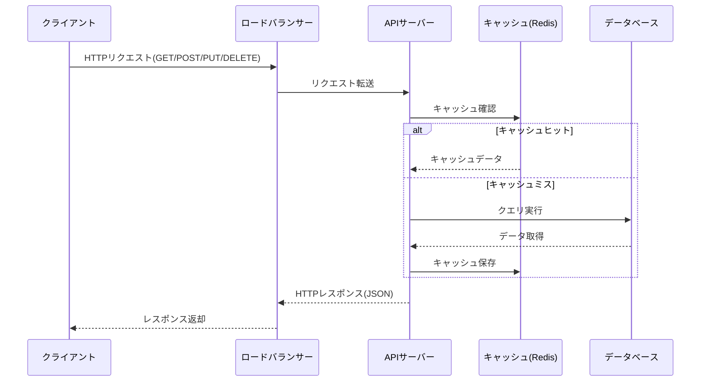
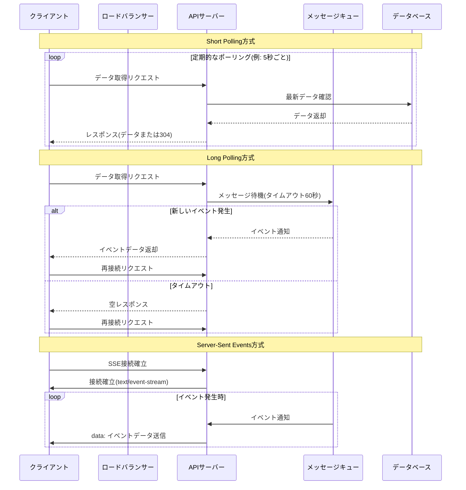
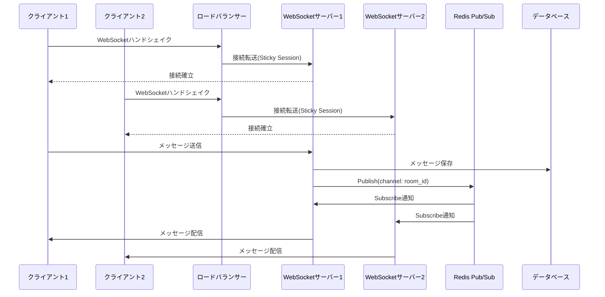
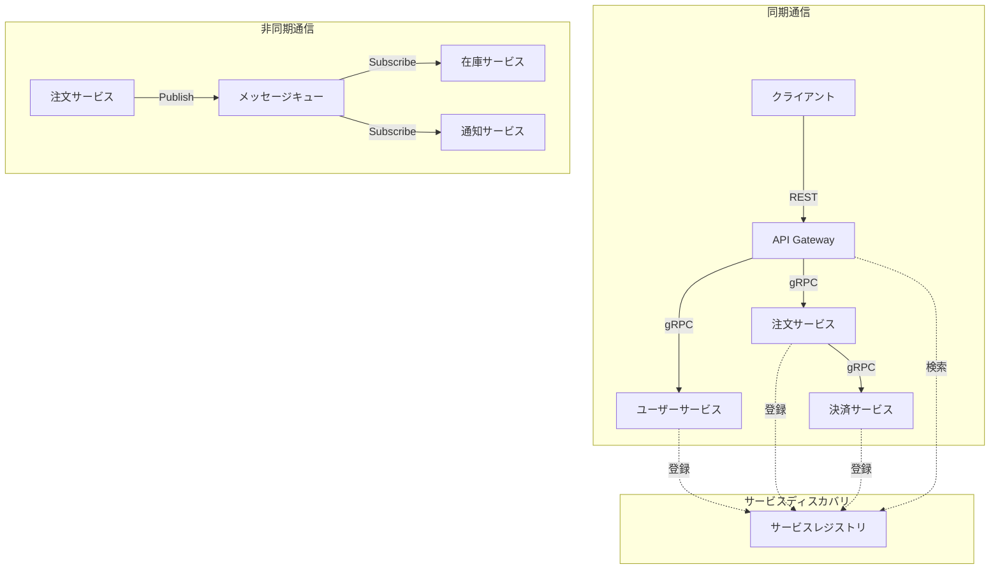
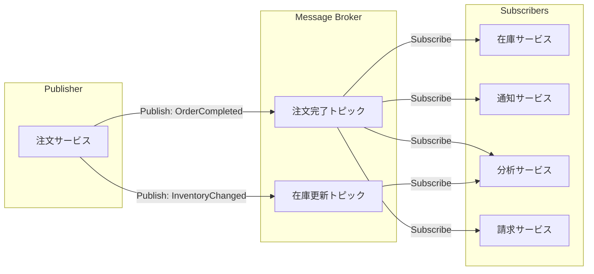
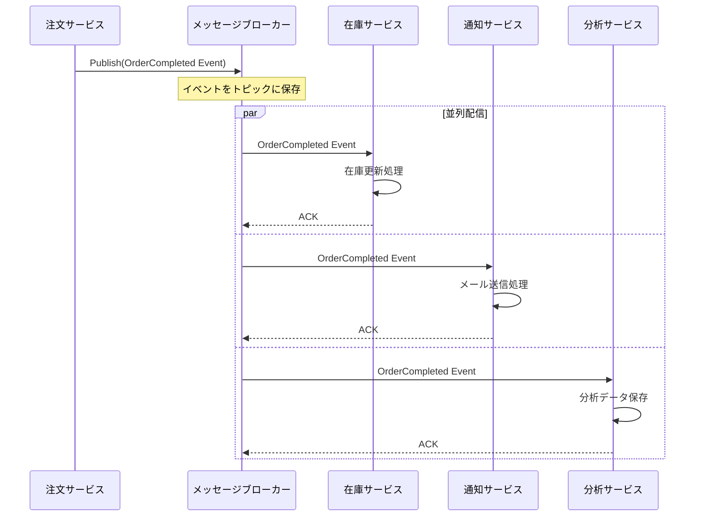

# コミュニケーション設計

## リクエストを送信(HTTP)

### 概要

HTTPは、クライアントとサーバー間でデータをやり取りする際の標準的なプロトコルです。
RESTful APIを実装する場合、HTTP methodsを適切に使い分け、ステートレスな設計を実現します。

### システム設計図

### 設計のポイント

ロードバランサーを配置することで、複数のAPIサーバーに負荷を分散します。
キャッシュレイヤーを導入することで、データベースへの負荷を軽減し、レスポンス速度を向上させます。
HTTPステータスコードを適切に使用し、エラーハンドリングを明確にします。
冪等性を保証することで、ネットワーク障害時のリトライを安全に実行できます。

## サーバー側の更新をリアルタイムに受け取る(Polling / Long Polling / SSE)

### 概要

サーバー側の状態変更をクライアントに通知する方法として、Polling、Long Polling、Server-Sent Events(SSE)があります。
それぞれの特性を理解し、ユースケースに応じて選択します。

### システム設計図

### 設計のポイント

Short Pollingは、実装がシンプルですが、無駄なリクエストが多く発生します。
Long Pollingは、リアルタイム性が向上しますが、コネクション管理が必要です。
SSEは、サーバーからクライアントへの一方向通信に適しており、自動再接続機能を持ちます。
タイムアウト値は、ネットワーク環境やユースケースに応じて調整します。

## リアルタイム双方向通信(WebSocket)

### 概要

WebSocketは、クライアントとサーバー間で双方向のリアルタイム通信を実現するプロトコルです。
チャットアプリケーションやリアルタイムコラボレーションツールなどで使用されます。

### システム設計図

### 設計のポイント

Sticky Sessionを使用して、同じクライアントを同じサーバーに接続し続けます。
Redis Pub/Subを使用して、複数のWebSocketサーバー間でメッセージを同期します。
コネクション数の上限を考慮し、サーバーのスケーリングを計画します。
ハートビートを定期的に送信して、接続の生存確認を行います。
再接続時のメッセージ取得ロジックを実装し、メッセージの欠落を防ぎます。

## サービス間通信の設計

### 概要

マイクロサービスアーキテクチャにおいて、サービス間の通信方法を適切に設計します。
同期通信(REST、gRPC)と非同期通信(メッセージキュー)を使い分けます。

### システム設計図

### 設計のポイント

同期通信は、即座にレスポンスが必要な場合に使用します。
非同期通信は、処理の完了を待つ必要がない場合や、複数サービスへの通知が必要な場合に使用します。
サービスディスカバリを導入して、動的なサービス検出とロードバランシングを実現します。
Circuit Breakerパターンを実装して、障害の連鎖を防ぎます。
タイムアウト値とリトライポリシーを適切に設定します。

## Pub/Subで複数のサービスにメッセージ配信

### 概要

Publish/Subscribeパターンを使用して、1つのイベントを複数のサービスに非同期で配信します。
サービス間の疎結合を実現し、システムの拡張性を向上させます。

### システム設計図

### 設計のポイント

メッセージブローカー(Kafka、RabbitMQ、AWS SNS/SQSなど)を使用して、信頼性の高いメッセージ配信を実現します。
各サブスクライバーは独立して動作し、他のサブスクライバーの障害に影響されません。
メッセージの順序保証が必要な場合は、パーティションキーを使用します。
メッセージの重複配信に対応するため、冪等性を考慮した処理を実装します。
Dead Letter Queueを設定して、処理に失敗したメッセージを別途管理します。
