# スケーラビリティ設計

## 垂直スケーリングと水平スケーリング

### 概要

垂直スケーリング(Scale Up)は、サーバーのスペックを向上させる方法です。
水平スケーリング(Scale Out)は、サーバーの台数を増やす方法です。
それぞれの特性を理解し、システムの要件に応じて選択します。

### システム設計図

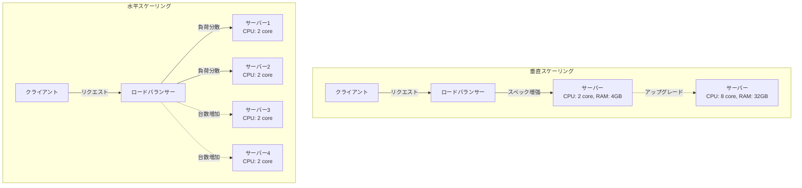

### 設計のポイント

垂直スケーリングは、実装がシンプルですが、物理的な上限があります。
水平スケーリングは、理論上無限に拡張できますが、ステート管理が複雑になります。
本番環境では、水平スケーリングを基本とし、必要に応じて垂直スケーリングを組み合わせます。
データベースは垂直スケーリングから始め、必要に応じてシャーディングで水平スケーリングします。

## オートスケール

### 概要

負荷に応じて自動的にサーバーの台数を増減させる仕組みです。
コスト効率を向上させながら、ピーク時のパフォーマンスを維持します。

### システム設計図

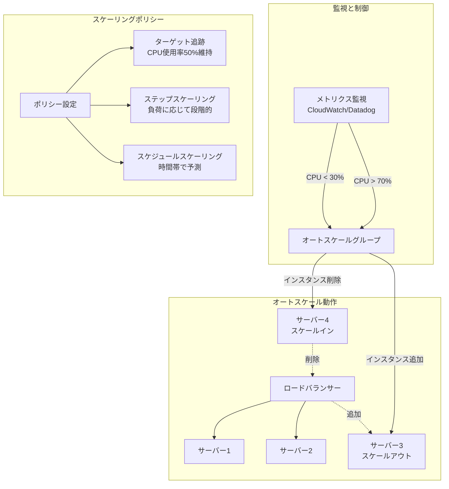

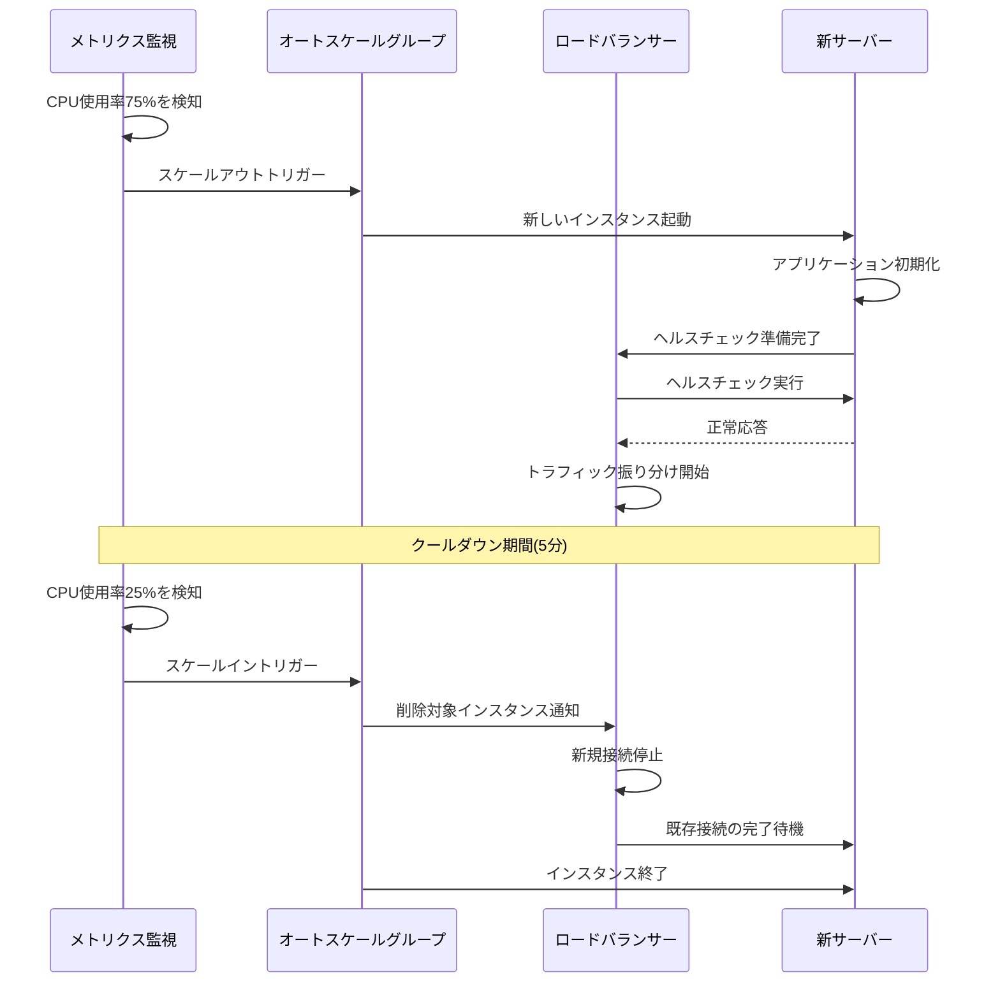

### 設計のポイント

スケーリングメトリクスは、CPU使用率、メモリ使用率、リクエスト数などを組み合わせます。
クールダウン期間を設定して、頻繁なスケーリングを防ぎます。
最小インスタンス数と最大インスタンス数を適切に設定します。
ヘルスチェックを実装して、正常なインスタンスのみをトラフィック対象にします。
グレースフルシャットダウンを実装して、処理中のリクエストを完了させてから終了します。

## ロードバランサーでリクエストを負荷分散

### 概要

ロードバランサーは、複数のサーバーにリクエストを分散し、システム全体の可用性とパフォーマンスを向上させます。
アルゴリズムの選択により、異なる負荷分散戦略を実現します。

### システム設計図

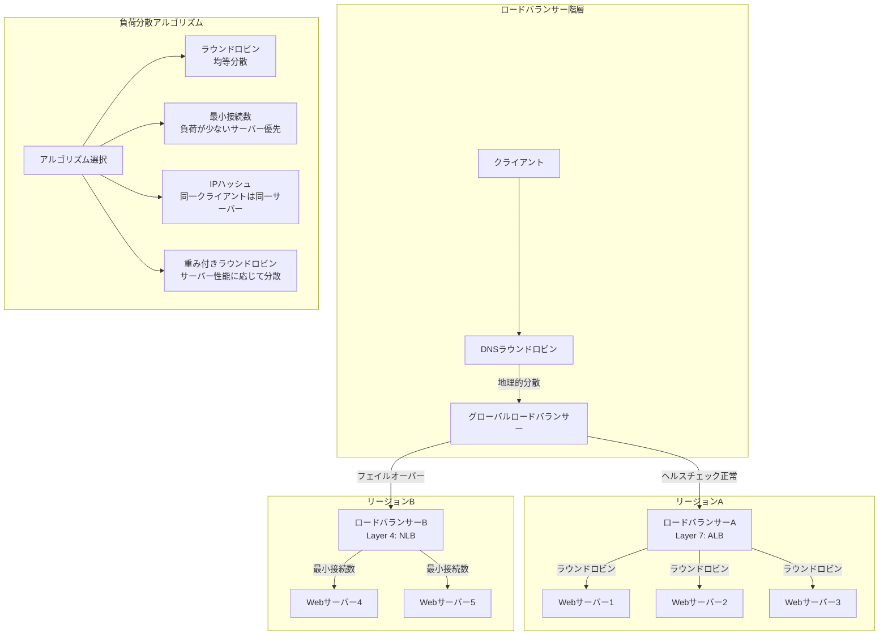

### 設計のポイント

Layer 7ロードバランサー(ALB)は、HTTPヘッダーやパスベースのルーティングが可能です。
Layer 4ロードバランサー(NLB)は、低レイテンシで高スループットが必要な場合に使用します。
ヘルスチェックを定期的に実行して、異常なサーバーへのルーティングを停止します。
セッション維持が必要な場合は、Sticky Sessionまたは外部セッションストアを使用します。
SSL/TLS終端をロードバランサーで行い、バックエンドサーバーの負荷を軽減します。

## データベースレプリケーションによるクエリの分散

### 概要

データベースのレプリケーションにより、読み取り負荷を複数のレプリカに分散します。
マスタースレーブ構成により、書き込みはマスターに、読み取りはスレーブに振り分けます。

### システム設計図

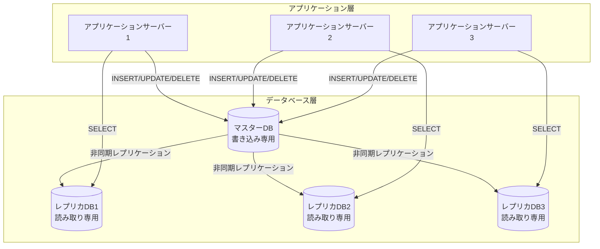

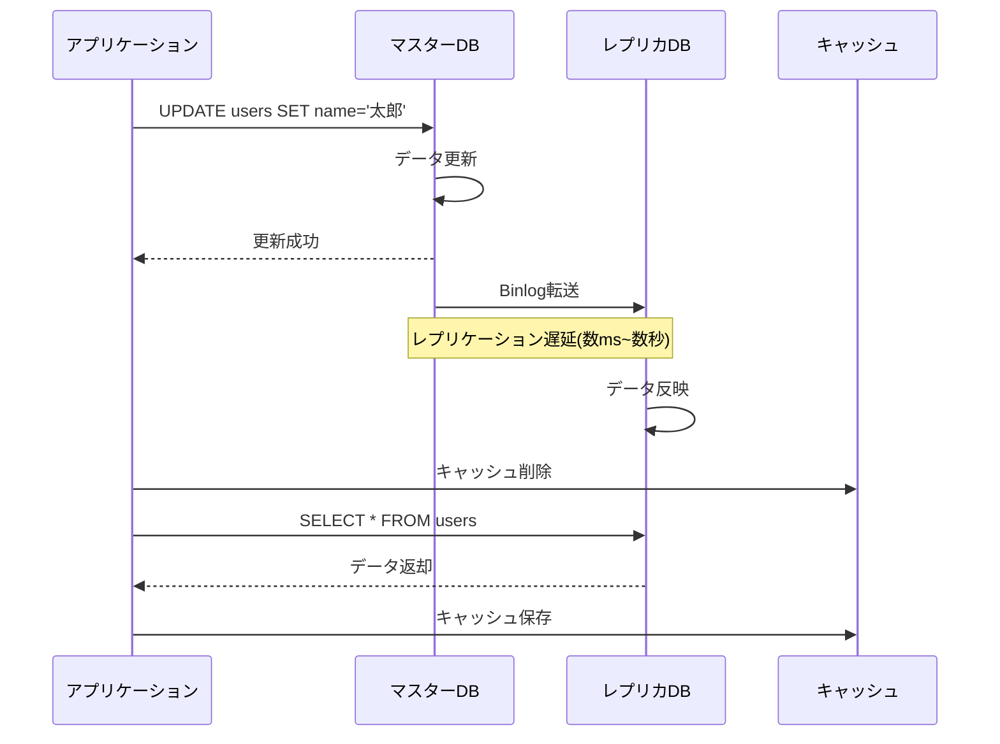

### 設計のポイント

レプリケーション遅延を考慮して、強整合性が必要な読み取りはマスターから行います。
レプリカの台数は、読み取り負荷に応じて調整します。
レプリカの障害時は、他のレプリカに自動的にフェイルオーバーします。
非同期レプリケーションによる遅延を許容できない場合は、準同期レプリケーションを検討します。
読み取り後に即座に更新が必要な場合は、Read-after-Write整合性を保証します。

## パーティショニングによるスケーラビリティの向上

### 概要

データベースのパーティショニング(シャーディング)により、データを複数のサーバーに分散します。
水平分割により、大量のデータと高い書き込み負荷に対応します。

### システム設計図

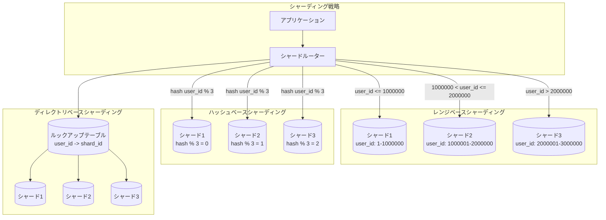

### 設計のポイント

シャードキーは、データの分散が均等になるように選択します。
レンジベースシャーディングは、範囲検索に有利ですが、ホットスポットが発生しやすいです。
ハッシュベースシャーディングは、データが均等に分散されますが、範囲検索ができません。
ディレクトリベースシャーディングは、柔軟性が高いですが、ルックアップテーブルがボトルネックになる可能性があります。
クロスシャードクエリを最小化するようなデータモデルを設計します。

## Consistent Hashing(コンシステントハッシュ法)

### 概要

Consistent Hashingは、ノードの追加や削除時に、再配置が必要なデータ量を最小限に抑える手法です。
分散キャッシュやデータベースのシャーディングで使用されます。

### システム設計図

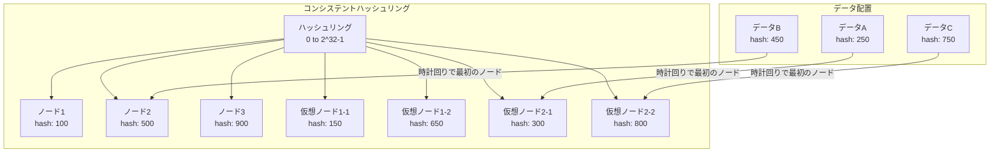

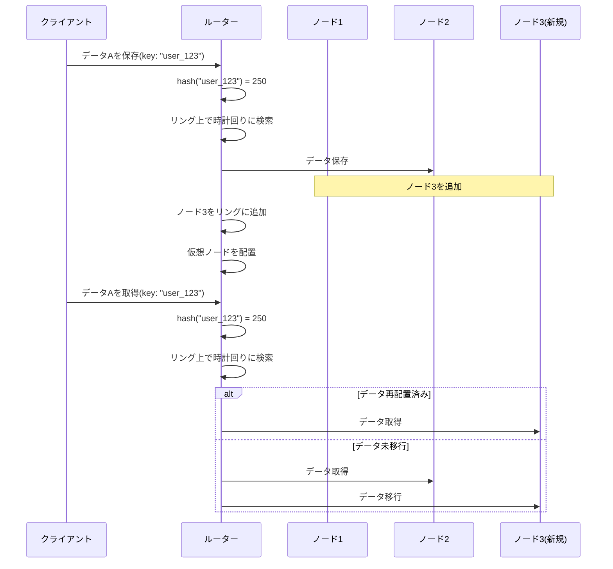

### 設計のポイント

仮想ノードを使用することで、データの分散をより均等にします。
ノードの追加時は、影響を受けるデータのみを再配置します。
レプリケーション係数を設定して、時計回りに複数のノードにデータを保存します。
ノードの削除時は、そのノードのデータを次のノードに移行します。
ハッシュ関数は、均一な分散を保証する関数(MD5、SHA-1など)を使用します。

## メッセージキューによるスケーラビリティの向上

### 概要

メッセージキューを使用して、同期処理を非同期化し、システムのスケーラビリティを向上させます。
プロデューサーとコンシューマーを分離することで、独立したスケーリングが可能になります。

### システム設計図

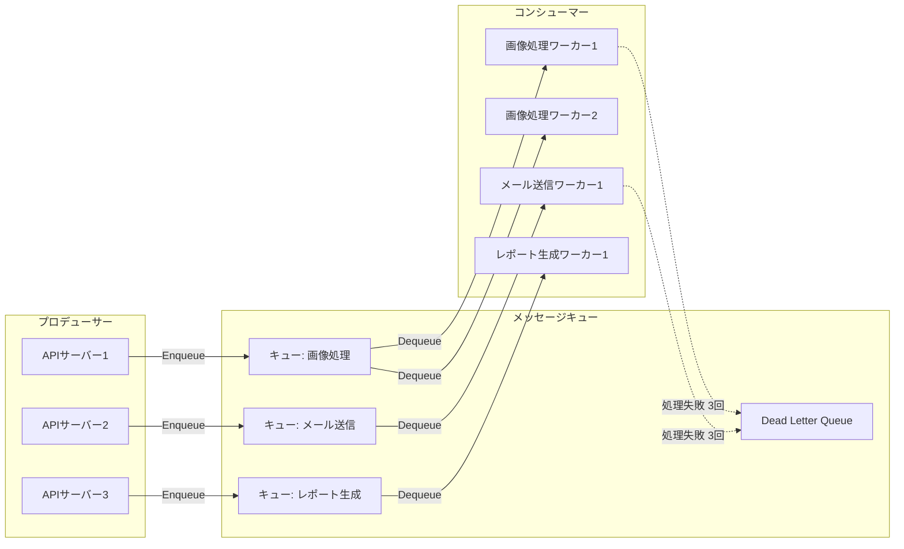

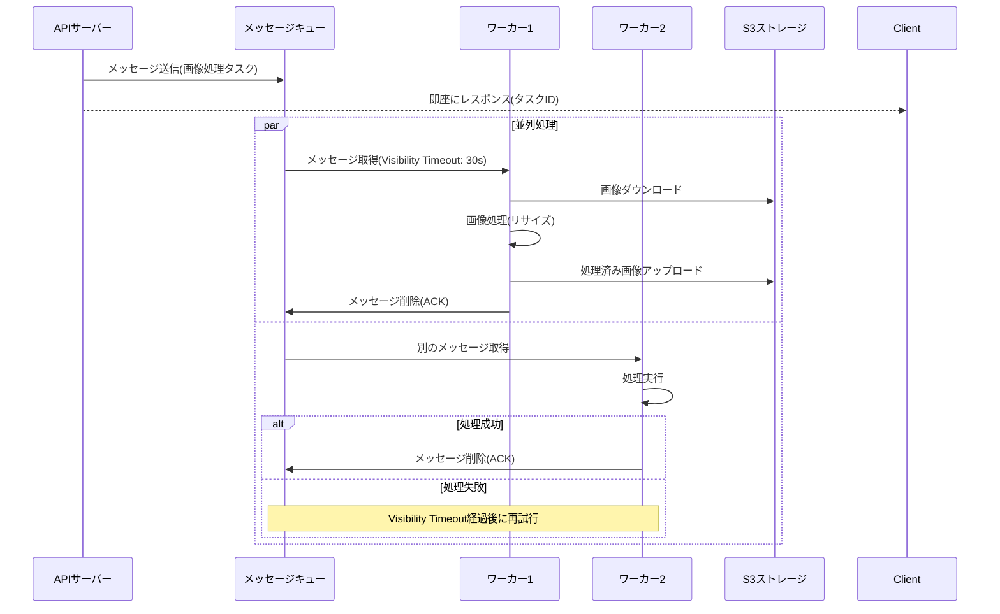

### 設計のポイント

メッセージの可視性タイムアウトは、処理時間より長く設定します。
冪等性を保証して、メッセージの重複処理に対応します。
リトライ回数の上限を設定し、処理に失敗したメッセージはDead Letter Queueに移動します。
優先度付きキューを使用して、重要なタスクを優先的に処理します。
コンシューマーの数を動的に調整して、キューの長さに応じてスケールします。

## ステートフル接続に対してスケーラブルな設計を行う

### 概要

WebSocketやTCP接続などのステートフル接続を扱う場合、セッションの維持とスケーラビリティの両立が必要です。
Sticky SessionやRedisを使用したセッション共有により、水平スケーリングを実現します。

### システム設計図

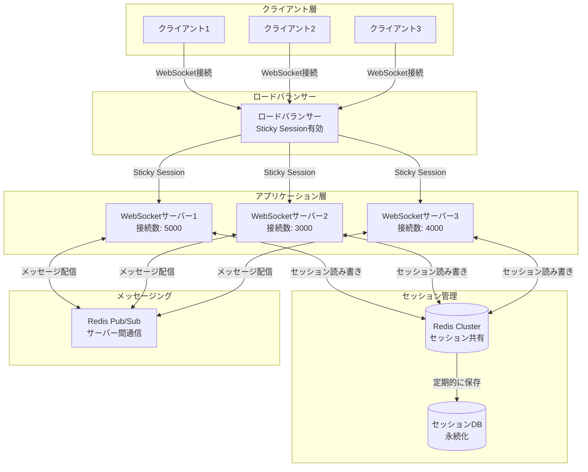

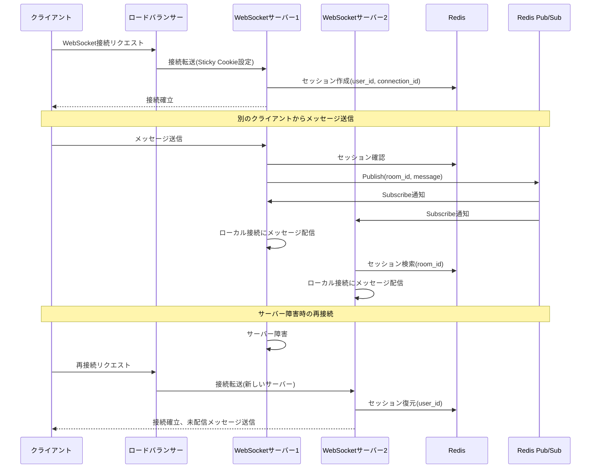

### 設計のポイント

Sticky Sessionを使用して、同じクライアントを同じサーバーに接続し続けます。
Redisにセッション情報を保存して、サーバー障害時に別のサーバーでセッションを復元できるようにします。
コネクション数の上限を監視して、新しいサーバーを自動的に追加します。
ハートビートを定期的に送信して、死活監視を行います。
グレースフルシャットダウンを実装して、既存の接続を適切にクローズしてから新しいサーバーに移行します。
