# パフォーマンス設計

## ネットワークレイテンシを改善する

### 概要

ネットワークレイテンシは、システムのパフォーマンスに大きな影響を与えます。
地理的分散、CDN、接続の最適化により、レイテンシを削減します。

### システム設計図

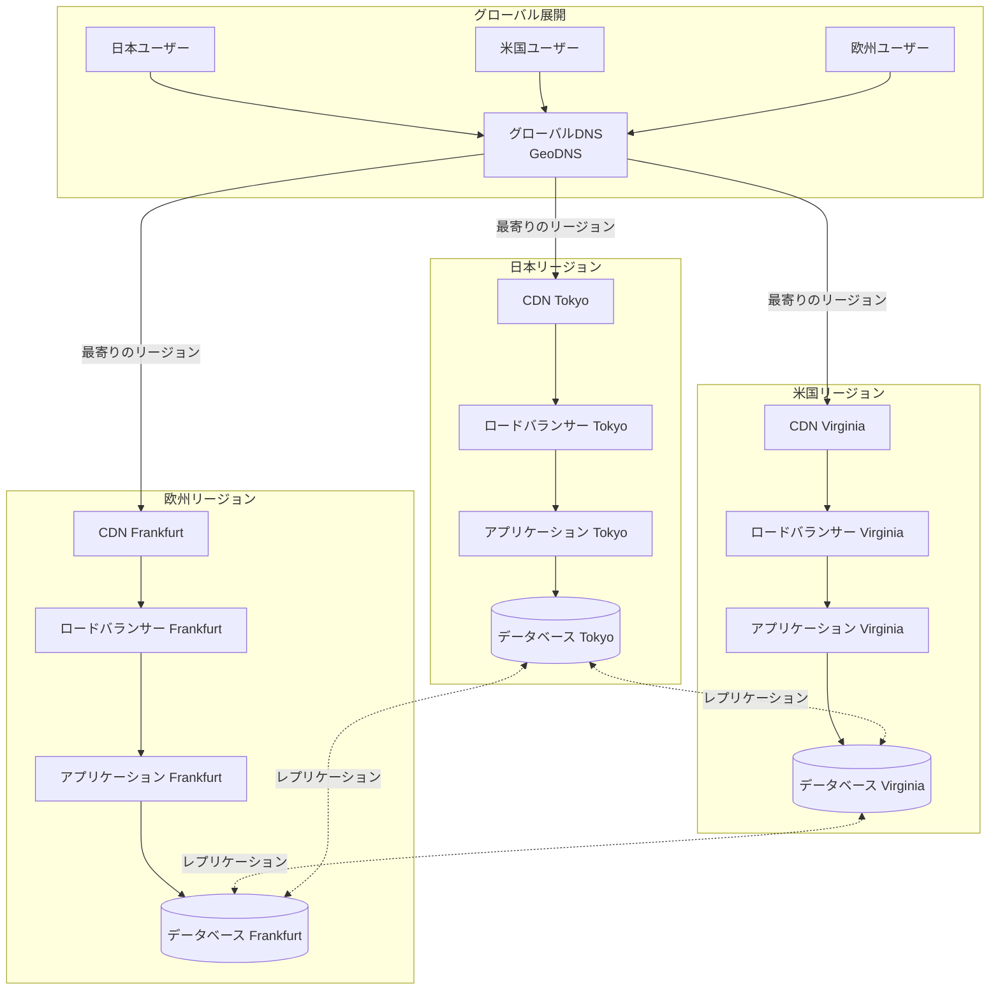
```mermaid
graph TB
    subgraph "グローバル展開"
        User_JP[日本ユーザー]
        User_US[米国ユーザー]
        User_EU[欧州ユーザー]
        
        DNS[グローバルDNS<br/>GeoDNS]
    end
    
    subgraph "日本リージョン"
        CDN_JP[CDN Tokyo]
        LB_JP[ロードバランサー Tokyo]
        APP_JP[アプリケーション Tokyo]
        DB_JP[(データベース Tokyo)]
    end
    
    subgraph "米国リージョン"
        CDN_US[CDN Virginia]
        LB_US[ロードバランサー Virginia]
        APP_US[アプリケーション Virginia]
        DB_US[(データベース Virginia)]
    end
    
    subgraph "欧州リージョン"
        CDN_EU[CDN Frankfurt]
        LB_EU[ロードバランサー Frankfurt]
        APP_EU[アプリケーション Frankfurt]
        DB_EU[(データベース Frankfurt)]
    end
    
    User_JP --> DNS
    User_US --> DNS
    User_EU --> DNS
    
    DNS -->|最寄りのリージョン| CDN_JP
    DNS -->|最寄りのリージョン| CDN_US
    DNS -->|最寄りのリージョン| CDN_EU
    
    CDN_JP --> LB_JP --> APP_JP --> DB_JP
    CDN_US --> LB_US --> APP_US --> DB_US
    CDN_EU --> LB_EU --> APP_EU --> DB_EU
    
    DB_JP <-.->|レプリケーション| DB_US
    DB_US <-.->|レプリケーション| DB_EU
    DB_EU <-.->|レプリケーション| DB_JP
```

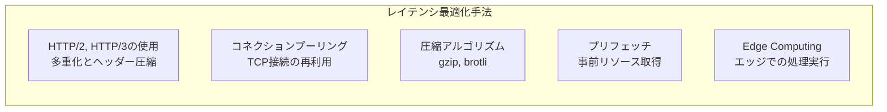
```mermaid
graph LR
    subgraph "レイテンシ最適化手法"
        Opt1[HTTP/2, HTTP/3の使用<br/>多重化とヘッダー圧縮]
        Opt2[コネクションプーリング<br/>TCP接続の再利用]
        Opt3[圧縮アルゴリズム<br/>gzip, brotli]
        Opt4[プリフェッチ<br/>事前リソース取得]
        Opt5[Edge Computing<br/>エッジでの処理実行]
    end
```

### 設計のポイント

GeoDNSを使用して、ユーザーに最も近いリージョンにリクエストをルーティングします。
HTTP/2やHTTP/3を使用して、コネクションの多重化とヘッダー圧縮を実現します。
コネクションプーリングを実装して、TCP接続の確立コストを削減します。
データベースのレプリケーションにより、読み取りを各リージョンで実行できるようにします。
Edge Computingを活用して、ユーザーに近い場所で処理を実行します。

## キャッシュを使ったパフォーマンスを向上

### 概要

キャッシュは、頻繁にアクセスされるデータを高速なストレージに保存することで、パフォーマンスを劇的に向上させます。
複数のキャッシュレイヤーを組み合わせることで、最適なパフォーマンスを実現します。

### システム設計図

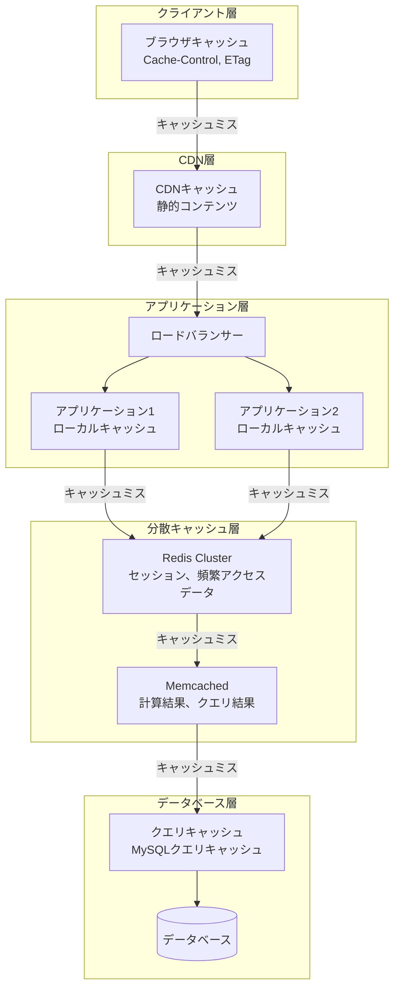
```mermaid
graph TB
    subgraph "クライアント層"
        Browser[ブラウザキャッシュ<br/>Cache-Control, ETag]
    end
    
    subgraph "CDN層"
        CDN[CDNキャッシュ<br/>静的コンテンツ]
    end
    
    subgraph "アプリケーション層"
        LB[ロードバランサー]
        App1[アプリケーション1<br/>ローカルキャッシュ]
        App2[アプリケーション2<br/>ローカルキャッシュ]
    end
    
    subgraph "分散キャッシュ層"
        Redis[Redis Cluster<br/>セッション、頻繁アクセスデータ]
        Memcached[Memcached<br/>計算結果、クエリ結果]
    end
    
    subgraph "データベース層"
        DBCache[クエリキャッシュ<br/>MySQLクエリキャッシュ]
        DB[(データベース)]
    end
    
    Browser -->|キャッシュミス| CDN
    CDN -->|キャッシュミス| LB
    LB --> App1
    LB --> App2
    
    App1 -->|キャッシュミス| Redis
    App2 -->|キャッシュミス| Redis
    
    Redis -->|キャッシュミス| Memcached
    Memcached -->|キャッシュミス| DBCache
    DBCache --> DB
```

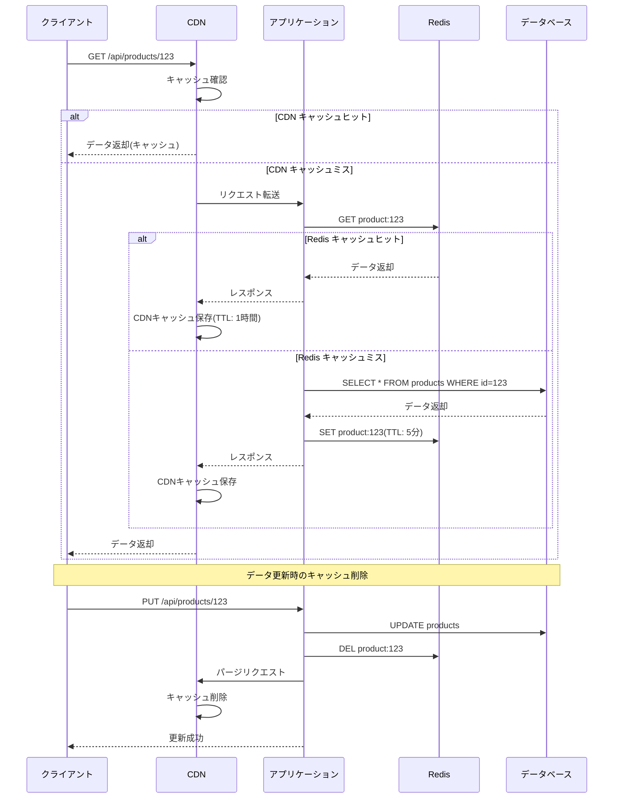
```mermaid
sequenceDiagram
    participant Client as クライアント
    participant CDN as CDN
    participant App as アプリケーション
    participant Redis as Redis
    participant DB as データベース

    Client->>CDN: GET /api/products/123
    CDN->>CDN: キャッシュ確認
    alt CDN キャッシュヒット
        CDN-->>Client: データ返却(キャッシュ)
    else CDN キャッシュミス
        CDN->>App: リクエスト転送
        App->>Redis: GET product:123
        alt Redis キャッシュヒット
            Redis-->>App: データ返却
            App-->>CDN: レスポンス
            CDN->>CDN: CDNキャッシュ保存(TTL: 1時間)
        else Redis キャッシュミス
            App->>DB: SELECT * FROM products WHERE id=123
            DB-->>App: データ返却
            App->>Redis: SET product:123(TTL: 5分)
            App-->>CDN: レスポンス
            CDN->>CDN: CDNキャッシュ保存
        end
        CDN-->>Client: データ返却
    end
    
    Note over Client,DB: データ更新時のキャッシュ削除
    
    Client->>App: PUT /api/products/123
    App->>DB: UPDATE products
    App->>Redis: DEL product:123
    App->>CDN: パージリクエスト
    CDN->>CDN: キャッシュ削除
    App-->>Client: 更新成功
```

### 設計のポイント

キャッシュのTTL(有効期限)は、データの更新頻度に応じて設定します。
Cache-Asideパターンを使用して、キャッシュミス時にアプリケーションがデータを取得してキャッシュに保存します。
Write-Throughパターンを使用して、書き込み時に同時にキャッシュも更新します。
キャッシュの無効化戦略を明確にして、古いデータを提供しないようにします。
キャッシュのウォームアップを実装して、起動時に頻繁にアクセスされるデータをプリロードします。

## CDNによる静的コンテンツのキャッシュ

### 概要

CDN(Content Delivery Network)は、静的コンテンツをエッジロケーションにキャッシュして、ユーザーに高速に配信します。
画像、CSS、JavaScript、動画などの静的ファイルに適用します。

### システム設計図

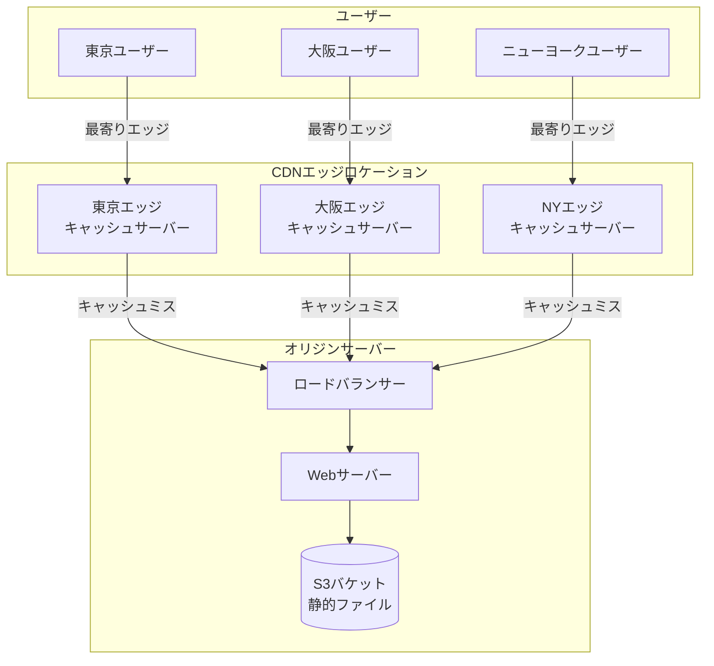
```mermaid
graph TB
    subgraph "ユーザー"
        User_Tokyo[東京ユーザー]
        User_Osaka[大阪ユーザー]
        User_NY[ニューヨークユーザー]
    end
    
    subgraph "CDNエッジロケーション"
        Edge_Tokyo[東京エッジ<br/>キャッシュサーバー]
        Edge_Osaka[大阪エッジ<br/>キャッシュサーバー]
        Edge_NY[NYエッジ<br/>キャッシュサーバー]
    end
    
    subgraph "オリジンサーバー"
        LB[ロードバランサー]
        WebServer[Webサーバー]
        S3[(S3バケット<br/>静的ファイル)]
    end
    
    User_Tokyo -->|最寄りエッジ| Edge_Tokyo
    User_Osaka -->|最寄りエッジ| Edge_Osaka
    User_NY -->|最寄りエッジ| Edge_NY
    
    Edge_Tokyo -->|キャッシュミス| LB
    Edge_Osaka -->|キャッシュミス| LB
    Edge_NY -->|キャッシュミス| LB
    
    LB --> WebServer
    WebServer --> S3
```

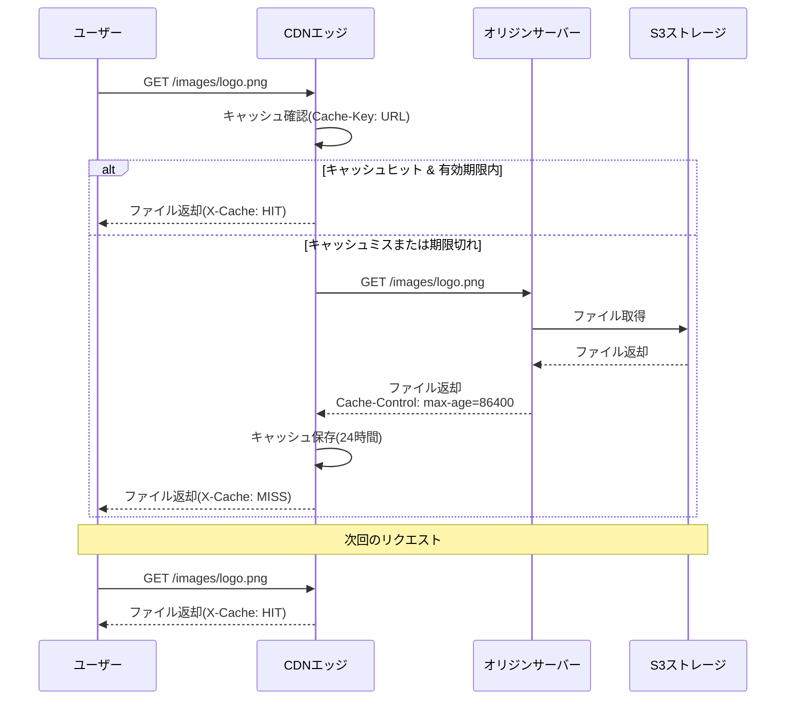
```mermaid
sequenceDiagram
    participant User as ユーザー
    participant Edge as CDNエッジ
    participant Origin as オリジンサーバー
    participant S3 as S3ストレージ

    User->>Edge: GET /images/logo.png
    Edge->>Edge: キャッシュ確認(Cache-Key: URL)
    alt キャッシュヒット & 有効期限内
        Edge-->>User: ファイル返却(X-Cache: HIT)
    else キャッシュミスまたは期限切れ
        Edge->>Origin: GET /images/logo.png
        Origin->>S3: ファイル取得
        S3-->>Origin: ファイル返却
        Origin-->>Edge: ファイル返却<br/>Cache-Control: max-age=86400
        Edge->>Edge: キャッシュ保存(24時間)
        Edge-->>User: ファイル返却(X-Cache: MISS)
    end
    
    Note over User,S3: 次回のリクエスト
    
    User->>Edge: GET /images/logo.png
    Edge-->>User: ファイル返却(X-Cache: HIT)
```

### 設計のポイント

Cache-Controlヘッダーを適切に設定して、CDNとブラウザのキャッシュ動作を制御します。
バージョニングやクエリパラメータを使用して、ファイル更新時にキャッシュをバイパスします。
画像の最適化(WebP、AVIF形式への変換)をCDNで実行します。
圧縮(gzip、brotli)をCDNで実行して、転送量を削減します。
パージAPIを使用して、必要に応じてキャッシュを削除します。

## CDNによる動的コンテンツのキャッシュ

### 概要

CDNは、静的コンテンツだけでなく、一部の動的コンテンツもキャッシュできます。
APIレスポンスやパーソナライズされたコンテンツを、適切なキャッシュキーで管理します。

### システム設計図

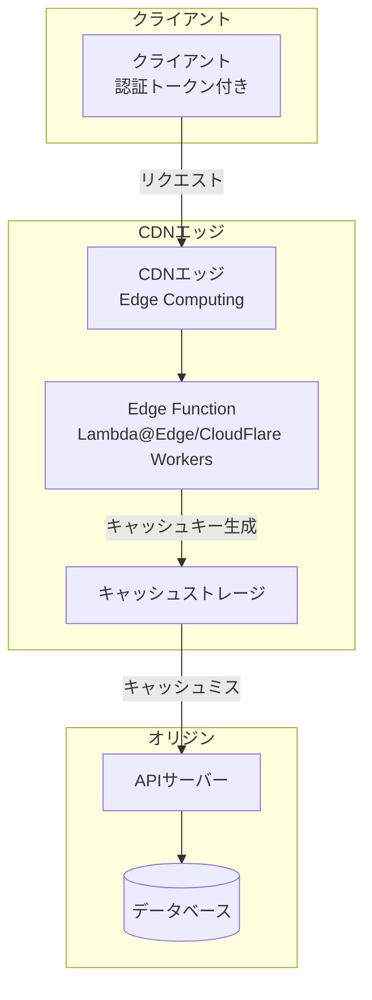
```mermaid
graph TB
    subgraph "クライアント"
        Client[クライアント<br/>認証トークン付き]
    end
    
    subgraph "CDNエッジ"
        Edge[CDNエッジ<br/>Edge Computing]
        EdgeCache[キャッシュストレージ]
        EdgeFunction[Edge Function<br/>Lambda@Edge/CloudFlare Workers]
    end
    
    subgraph "オリジン"
        API[APIサーバー]
        DB[(データベース)]
    end
    
    Client -->|リクエスト| Edge
    Edge --> EdgeFunction
    EdgeFunction -->|キャッシュキー生成| EdgeCache
    EdgeCache -->|キャッシュミス| API
    API --> DB
```

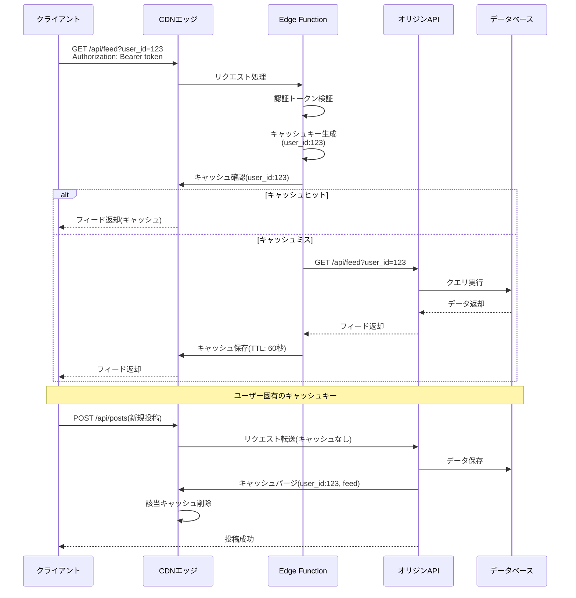
```mermaid
sequenceDiagram
    participant Client as クライアント
    participant Edge as CDNエッジ
    participant Lambda as Edge Function
    participant Origin as オリジンAPI
    participant DB as データベース

    Client->>Edge: GET /api/feed?user_id=123<br/>Authorization: Bearer token
    Edge->>Lambda: リクエスト処理
    Lambda->>Lambda: 認証トークン検証
    Lambda->>Lambda: キャッシュキー生成<br/>(user_id:123)
    Lambda->>Edge: キャッシュ確認(user_id:123)
    
    alt キャッシュヒット
        Edge-->>Client: フィード返却(キャッシュ)
    else キャッシュミス
        Lambda->>Origin: GET /api/feed?user_id=123
        Origin->>DB: クエリ実行
        DB-->>Origin: データ返却
        Origin-->>Lambda: フィード返却
        Lambda->>Edge: キャッシュ保存(TTL: 60秒)
        Edge-->>Client: フィード返却
    end
    
    Note over Client,DB: ユーザー固有のキャッシュキー
    
    Client->>Edge: POST /api/posts(新規投稿)
    Edge->>Origin: リクエスト転送(キャッシュなし)
    Origin->>DB: データ保存
    Origin->>Edge: キャッシュパージ(user_id:123, feed)
    Edge->>Edge: 該当キャッシュ削除
    Origin-->>Client: 投稿成功
```

### 設計のポイント

Vary ヘッダーやカスタムキャッシュキーを使用して、ユーザーごとに異なるコンテンツをキャッシュします。
認証トークンの検証をEdge Functionで実行して、オリジンサーバーへの負荷を軽減します。
短いTTLを設定して、データの鮮度を保ちます。
ユーザー行動(投稿、いいね等)によって関連するキャッシュを選択的にパージします。
キャッシュ可能なAPIと不可能なAPIを明確に分けます。

## インメモリデータベースを使ったキャッシュ

### 概要

RedisやMemcachedなどのインメモリデータベースを使用して、高速なデータアクセスを実現します。
セッション管理、リーダーボード、カウンター、分散ロックなど、様々なユースケースに対応します。

### システム設計図

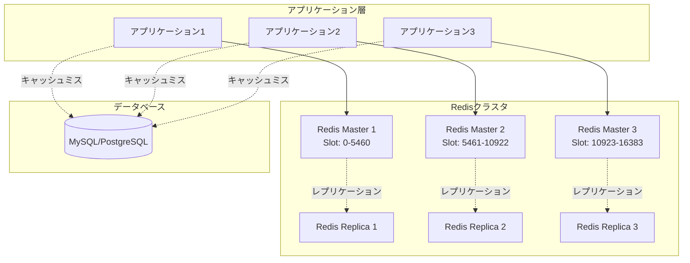
```mermaid
graph TB
    subgraph "アプリケーション層"
        App1[アプリケーション1]
        App2[アプリケーション2]
        App3[アプリケーション3]
    end
    
    subgraph "Redisクラスタ"
        RedisMaster1[Redis Master 1<br/>Slot: 0-5460]
        RedisReplica1[Redis Replica 1]
        
        RedisMaster2[Redis Master 2<br/>Slot: 5461-10922]
        RedisReplica2[Redis Replica 2]
        
        RedisMaster3[Redis Master 3<br/>Slot: 10923-16383]
        RedisReplica3[Redis Replica 3]
        
        RedisMaster1 -.->|レプリケーション| RedisReplica1
        RedisMaster2 -.->|レプリケーション| RedisReplica2
        RedisMaster3 -.->|レプリケーション| RedisReplica3
    end
    
    subgraph "データベース"
        DB[(MySQL/PostgreSQL)]
    end
    
    App1 --> RedisMaster1
    App2 --> RedisMaster2
    App3 --> RedisMaster3
    
    App1 -.->|キャッシュミス| DB
    App2 -.->|キャッシュミス| DB
    App3 -.->|キャッシュミス| DB
```

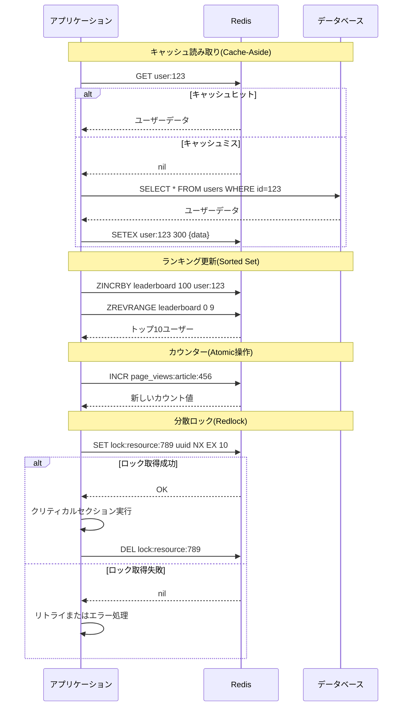
```mermaid
sequenceDiagram
    participant App as アプリケーション
    participant Redis as Redis
    participant DB as データベース

    Note over App,DB: キャッシュ読み取り(Cache-Aside)
    App->>Redis: GET user:123
    alt キャッシュヒット
        Redis-->>App: ユーザーデータ
    else キャッシュミス
        Redis-->>App: nil
        App->>DB: SELECT * FROM users WHERE id=123
        DB-->>App: ユーザーデータ
        App->>Redis: SETEX user:123 300 {data}
    end
    
    Note over App,DB: ランキング更新(Sorted Set)
    App->>Redis: ZINCRBY leaderboard 100 user:123
    App->>Redis: ZREVRANGE leaderboard 0 9
    Redis-->>App: トップ10ユーザー
    
    Note over App,DB: カウンター(Atomic操作)
    App->>Redis: INCR page_views:article:456
    Redis-->>App: 新しいカウント値
    
    Note over App,DB: 分散ロック(Redlock)
    App->>Redis: SET lock:resource:789 uuid NX EX 10
    alt ロック取得成功
        Redis-->>App: OK
        App->>App: クリティカルセクション実行
        App->>Redis: DEL lock:resource:789
    else ロック取得失敗
        Redis-->>App: nil
        App->>App: リトライまたはエラー処理
    end
```

### 設計のポイント

適切なデータ構造を選択します(String、Hash、List、Set、Sorted Set等)。
TTLを設定して、メモリ使用量を管理します。
LRU(Least Recently Used)などのevictionポリシーを設定します。
Redisクラスタを使用して、データを分散し、スケーラビリティを向上させます。
レプリケーションを設定して、高可用性を実現します。

## 並列分散処理によるパフォーマンス向上

### 概要

大量のデータや計算集約的なタスクを、複数のワーカーで並列に処理することで、パフォーマンスを向上させます。
MapReduceやタスクキューを使用して、効率的な分散処理を実現します。

### システム設計図

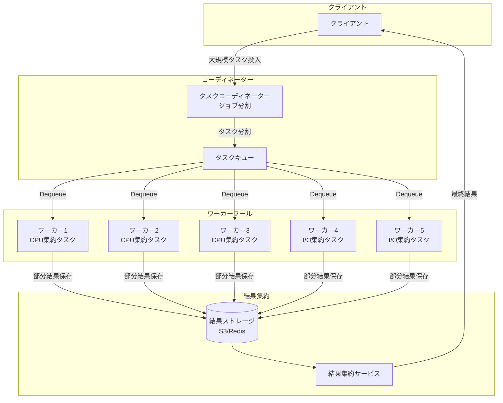
```mermaid
graph TB
    subgraph "クライアント"
        Client[クライアント]
    end
    
    subgraph "コーディネーター"
        Coordinator[タスクコーディネーター<br/>ジョブ分割]
        Queue[タスクキュー]
    end
    
    subgraph "ワーカープール"
        Worker1[ワーカー1<br/>CPU集約タスク]
        Worker2[ワーカー2<br/>CPU集約タスク]
        Worker3[ワーカー3<br/>CPU集約タスク]
        Worker4[ワーカー4<br/>I/O集約タスク]
        Worker5[ワーカー5<br/>I/O集約タスク]
    end
    
    subgraph "結果集約"
        ResultStore[(結果ストレージ<br/>S3/Redis)]
        Aggregator[結果集約サービス]
    end
    
    Client -->|大規模タスク投入| Coordinator
    Coordinator -->|タスク分割| Queue
    
    Queue -->|Dequeue| Worker1
    Queue -->|Dequeue| Worker2
    Queue -->|Dequeue| Worker3
    Queue -->|Dequeue| Worker4
    Queue -->|Dequeue| Worker5
    
    Worker1 -->|部分結果保存| ResultStore
    Worker2 -->|部分結果保存| ResultStore
    Worker3 -->|部分結果保存| ResultStore
    Worker4 -->|部分結果保存| ResultStore
    Worker5 -->|部分結果保存| ResultStore
    
    ResultStore --> Aggregator
    Aggregator -->|最終結果| Client
```

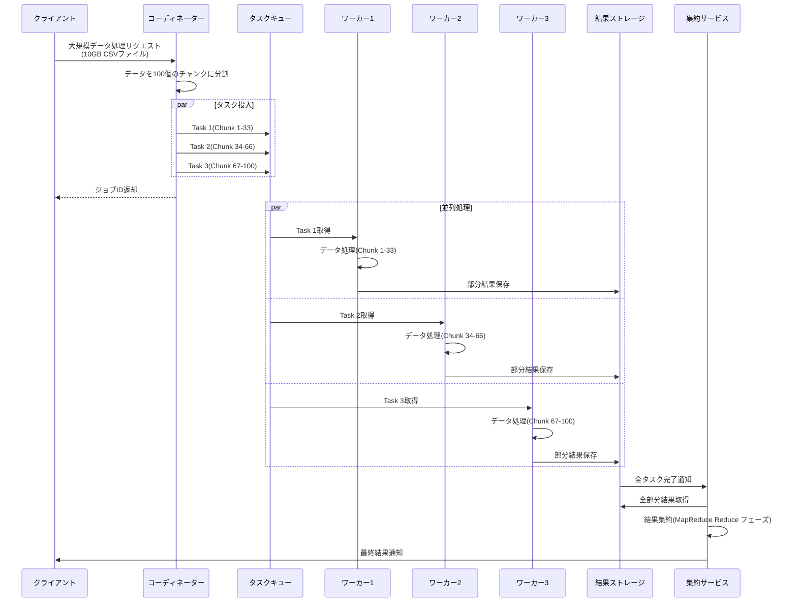
```mermaid
sequenceDiagram
    participant Client as クライアント
    participant Coord as コーディネーター
    participant Queue as タスクキュー
    participant W1 as ワーカー1
    participant W2 as ワーカー2
    participant W3 as ワーカー3
    participant Store as 結果ストレージ
    participant Agg as 集約サービス

    Client->>Coord: 大規模データ処理リクエスト<br/>(10GB CSVファイル)
    Coord->>Coord: データを100個のチャンクに分割
    
    par タスク投入
        Coord->>Queue: Task 1(Chunk 1-33)
        Coord->>Queue: Task 2(Chunk 34-66)
        Coord->>Queue: Task 3(Chunk 67-100)
    end
    
    Coord-->>Client: ジョブID返却
    
    par 並列処理
        Queue->>W1: Task 1取得
        W1->>W1: データ処理(Chunk 1-33)
        W1->>Store: 部分結果保存
    and
        Queue->>W2: Task 2取得
        W2->>W2: データ処理(Chunk 34-66)
        W2->>Store: 部分結果保存
    and
        Queue->>W3: Task 3取得
        W3->>W3: データ処理(Chunk 67-100)
        W3->>Store: 部分結果保存
    end
    
    Store->>Agg: 全タスク完了通知
    Agg->>Store: 全部分結果取得
    Agg->>Agg: 結果集約(MapReduce Reduce フェーズ)
    Agg->>Client: 最終結果通知
```

### 設計のポイント

タスクを適切なサイズに分割して、ワーカー間の負荷を均等にします。
ワーカーの数は、CPU数やI/O待機時間に応じて調整します。
タスクの失敗を検知して、自動的にリトライします。
部分結果をストレージに保存して、ワーカー障害時にも処理を継続できるようにします。
進捗状況を追跡して、クライアントに通知します。

## データベースインデックス

### 概要

データベースインデックスは、クエリのパフォーマンスを劇的に向上させます。
適切なインデックス設計により、検索速度を最適化しながら、書き込みパフォーマンスとのバランスを取ります。

### システム設計図

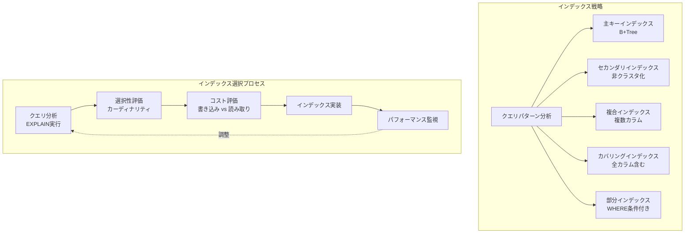
```mermaid
graph TB
    subgraph "インデックス戦略"
        Query[クエリパターン分析]
        Primary[主キーインデックス<br/>B+Tree]
        Secondary[セカンダリインデックス<br/>非クラスタ化]
        Composite[複合インデックス<br/>複数カラム]
        Covering[カバリングインデックス<br/>全カラム含む]
        Partial[部分インデックス<br/>WHERE条件付き]
        
        Query --> Primary
        Query --> Secondary
        Query --> Composite
        Query --> Covering
        Query --> Partial
    end
    
    subgraph "インデックス選択プロセス"
        Analyze[クエリ分析<br/>EXPLAIN実行]
        Selectivity[選択性評価<br/>カーディナリティ]
        Cost[コスト評価<br/>書き込み vs 読み取り]
        Implement[インデックス実装]
        Monitor[パフォーマンス監視]
        
        Analyze --> Selectivity
        Selectivity --> Cost
        Cost --> Implement
        Implement --> Monitor
        Monitor -.->|調整| Analyze
    end
```

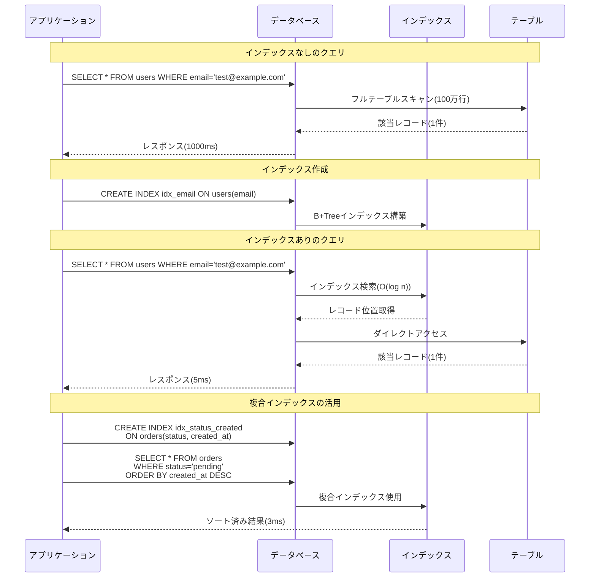
```mermaid
sequenceDiagram
    participant App as アプリケーション
    participant DB as データベース
    participant Index as インデックス
    participant Table as テーブル

    Note over App,Table: インデックスなしのクエリ
    App->>DB: SELECT * FROM users WHERE email='test@example.com'
    DB->>Table: フルテーブルスキャン(100万行)
    Table-->>DB: 該当レコード(1件)
    DB-->>App: レスポンス(1000ms)
    
    Note over App,Table: インデックス作成
    App->>DB: CREATE INDEX idx_email ON users(email)
    DB->>Index: B+Treeインデックス構築
    
    Note over App,Table: インデックスありのクエリ
    App->>DB: SELECT * FROM users WHERE email='test@example.com'
    DB->>Index: インデックス検索(O(log n))
    Index-->>DB: レコード位置取得
    DB->>Table: ダイレクトアクセス
    Table-->>DB: 該当レコード(1件)
    DB-->>App: レスポンス(5ms)
    
    Note over App,Table: 複合インデックスの活用
    App->>DB: CREATE INDEX idx_status_created<br/>ON orders(status, created_at)
    App->>DB: SELECT * FROM orders<br/>WHERE status='pending'<br/>ORDER BY created_at DESC
    DB->>Index: 複合インデックス使用
    Index-->>App: ソート済み結果(3ms)
```

### 設計のポイント

WHERE句、JOIN条件、ORDER BY句で頻繁に使用されるカラムにインデックスを作成します。
複合インデックスの順序は、カーディナリティの高い順に設定します。
カバリングインデックスを使用して、テーブルアクセスを完全に回避します。
インデックスの断片化を定期的にメンテナンスします。
不要なインデックスは削除して、書き込みパフォーマンスを向上させます。

## スロークエリ分析と最適化

### 概要

スロークエリログを分析して、パフォーマンスのボトルネックとなっているクエリを特定し、最適化します。
EXPLAINを使用してクエリ実行計画を確認し、改善策を実施します。

### システム設計図

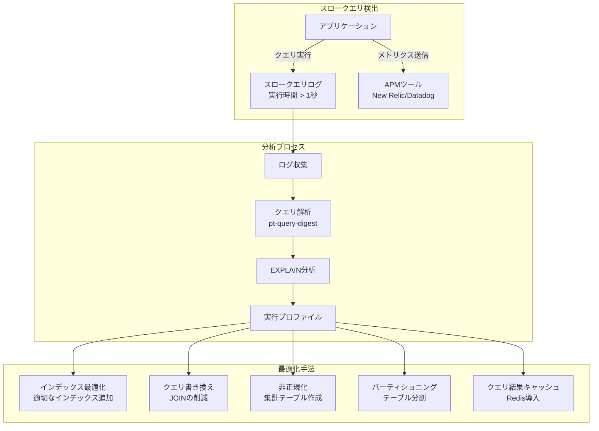
```mermaid
graph TB
    subgraph "スロークエリ検出"
        App[アプリケーション]
        SlowLog[スロークエリログ<br/>実行時間 > 1秒]
        APM[APMツール<br/>New Relic/Datadog]
        
        App -->|クエリ実行| SlowLog
        App -->|メトリクス送信| APM
    end
    
    subgraph "分析プロセス"
        Collect[ログ収集]
        Parse[クエリ解析<br/>pt-query-digest]
        Explain[EXPLAIN分析]
        Profile[実行プロファイル]
        
        SlowLog --> Collect
        Collect --> Parse
        Parse --> Explain
        Explain --> Profile
    end
    
    subgraph "最適化手法"
        IndexOpt[インデックス最適化<br/>適切なインデックス追加]
        QueryRewrite[クエリ書き換え<br/>JOINの削減]
        Denorm[非正規化<br/>集計テーブル作成]
        Partition[パーティショニング<br/>テーブル分割]
        Cache[クエリ結果キャッシュ<br/>Redis導入]
        
        Profile --> IndexOpt
        Profile --> QueryRewrite
        Profile --> Denorm
        Profile --> Partition
        Profile --> Cache
    end
```

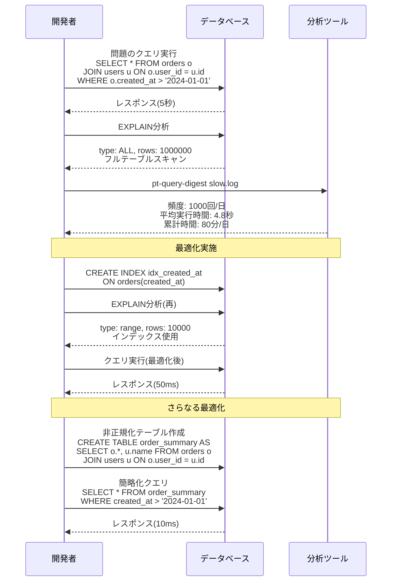
```mermaid
sequenceDiagram
    participant Dev as 開発者
    participant DB as データベース
    participant Tool as 分析ツール

    Dev->>DB: 問題のクエリ実行<br/>SELECT * FROM orders o<br/>JOIN users u ON o.user_id = u.id<br/>WHERE o.created_at > '2024-01-01'
    DB-->>Dev: レスポンス(5秒)
    
    Dev->>DB: EXPLAIN分析
    DB-->>Dev: type: ALL, rows: 1000000<br/>フルテーブルスキャン
    
    Dev->>Tool: pt-query-digest slow.log
    Tool-->>Dev: 頻度: 1000回/日<br/>平均実行時間: 4.8秒<br/>累計時間: 80分/日
    
    Note over Dev,Tool: 最適化実施
    
    Dev->>DB: CREATE INDEX idx_created_at<br/>ON orders(created_at)
    Dev->>DB: EXPLAIN分析(再)
    DB-->>Dev: type: range, rows: 10000<br/>インデックス使用
    
    Dev->>DB: クエリ実行(最適化後)
    DB-->>Dev: レスポンス(50ms)
    
    Note over Dev,Tool: さらなる最適化
    
    Dev->>DB: 非正規化テーブル作成<br/>CREATE TABLE order_summary AS<br/>SELECT o.*, u.name FROM orders o<br/>JOIN users u ON o.user_id = u.id
    
    Dev->>DB: 簡略化クエリ<br/>SELECT * FROM order_summary<br/>WHERE created_at > '2024-01-01'
    DB-->>Dev: レスポンス(10ms)
```

### 設計のポイント

スロークエリログの閾値を適切に設定します(例: 1秒)。
EXPLAINの結果を確認して、フルテーブルスキャンを回避します。
N+1問題を解決するため、eager loadingやJOINを使用します。
SELECT文で必要なカラムのみを指定し、SELECT *を避けます。
集計クエリは、事前に集計テーブルを作成して高速化します。
定期的にクエリパフォーマンスを監視し、継続的に改善します。
