# 可用性・耐障害性・信頼性設計

## 冗長化とフェイルオーバーによるシステムを切り替え

### 概要

システムの冗長化により、単一障害点を排除し、高可用性を実現します。
フェイルオーバー機構により、障害発生時に自動的に待機系に切り替えます。

### システム設計図

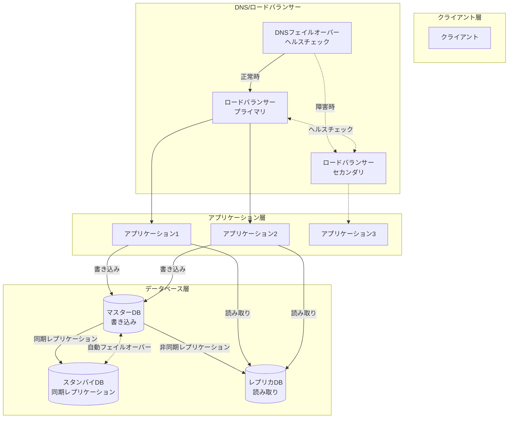

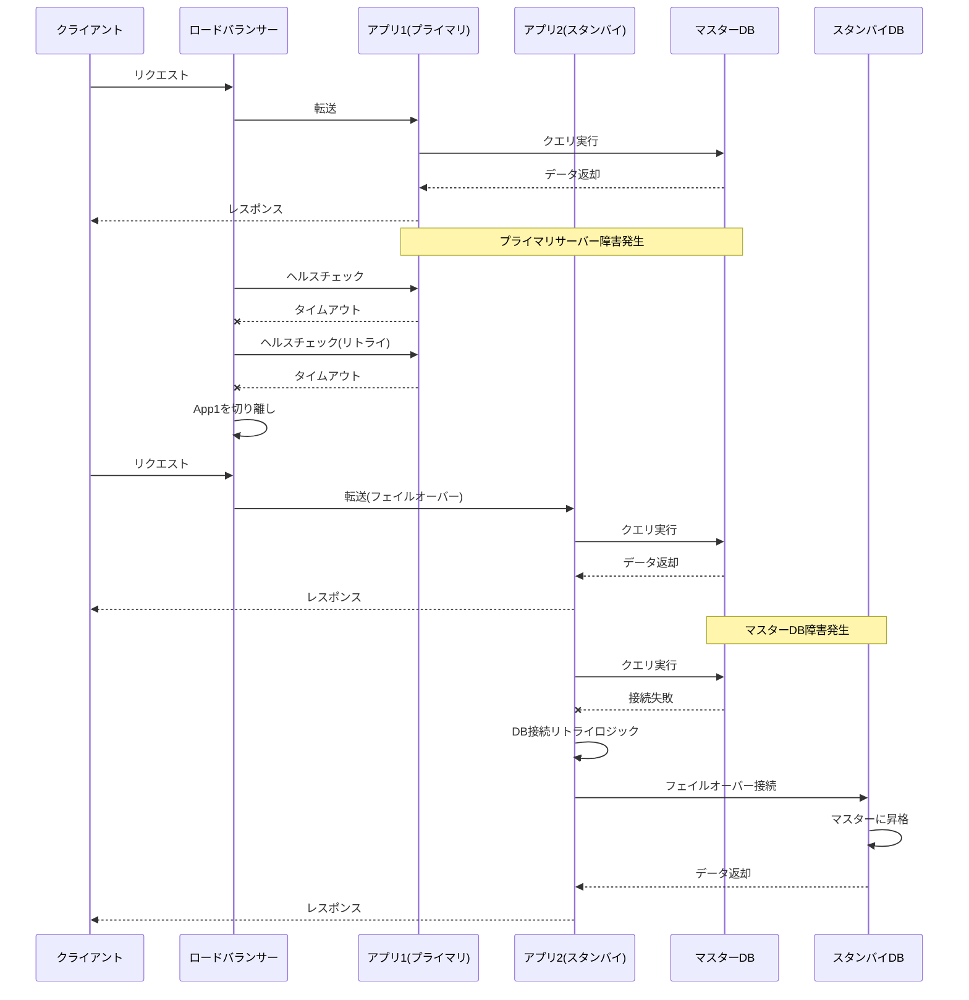

### 設計のポイント

ヘルスチェックの間隔と閾値を適切に設定して、誤検知を防ぎます。
同期レプリケーションを使用して、データ損失を最小限に抑えます。
フェイルオーバー時のダウンタイムを最小化するため、自動フェイルオーバーを実装します。
スプリットブレイン問題を防ぐため、クォーラムベースの判定を使用します。
定期的にフェイルオーバーテストを実施して、機構が正常に動作することを確認します。

## レプリケーションによる耐障害性、可用性の向上

### 概要

データベースのレプリケーションにより、データの冗長性を確保し、障害時のデータ損失を防ぎます。
複数のレプリケーション方式を理解し、要件に応じて選択します。

### システム設計図

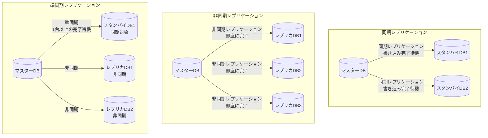

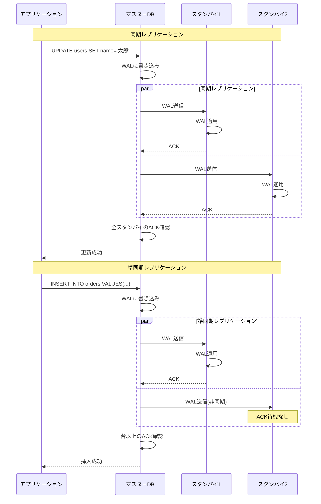

### 設計のポイント

同期レプリケーションは、データ損失ゼロを保証しますが、パフォーマンスが低下します。
非同期レプリケーションは、高パフォーマンスですが、障害時にデータ損失のリスクがあります。
準同期レプリケーションは、両者のバランスを取った方式です。
レプリケーション遅延を監視して、閾値を超えた場合にアラートを発行します。
クロスリージョンレプリケーションにより、災害対策を実現します。

## ログによるデータベースの耐障害性の向上

### 概要

WAL(Write-Ahead Logging)やトランザクションログを使用して、障害時のデータ復旧を可能にします。
ログベースのレプリケーションにより、データの整合性を保ちます。

### システム設計図

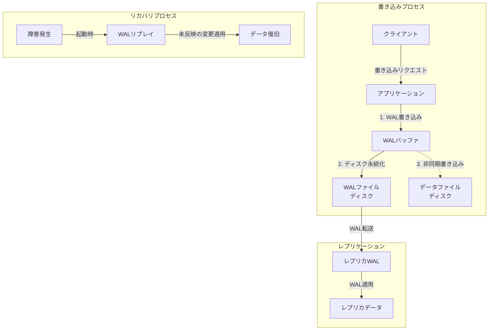

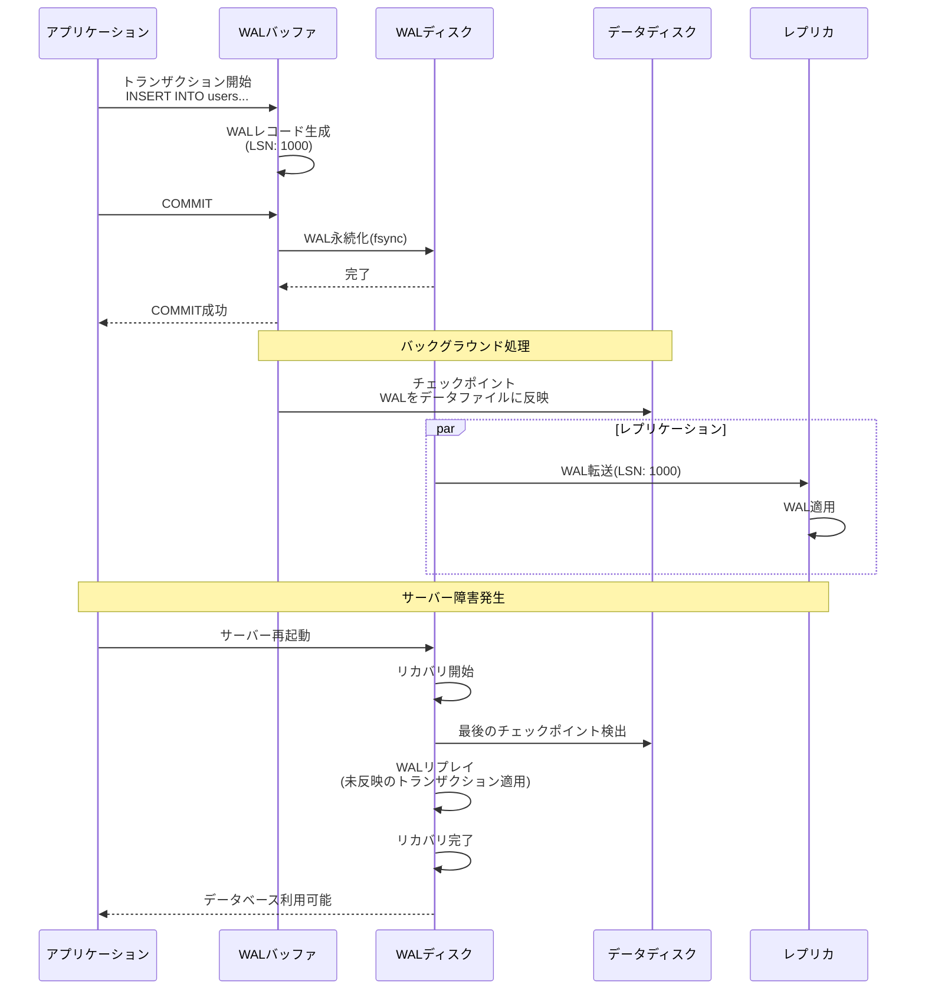

### 設計のポイント

WALファイルは、データファイルとは別のディスクに配置して、I/O性能を向上させます。
定期的にチェックポイントを実行して、リカバリ時間を短縮します。
WALアーカイブを別のストレージに保存して、Point-in-Time Recoveryを可能にします。
ログの肥大化を防ぐため、古いWALファイルを定期的に削除します。
レプリカはWALを受信してリプレイすることで、マスターと同じ状態を保ちます。

## オブジェクトストレージによる非構造化データの耐久性の向上

### 概要

S3などのオブジェクトストレージは、高い耐久性と可用性を提供します。
画像、動画、ログファイルなどの非構造化データを安全に保存します。

### システム設計図

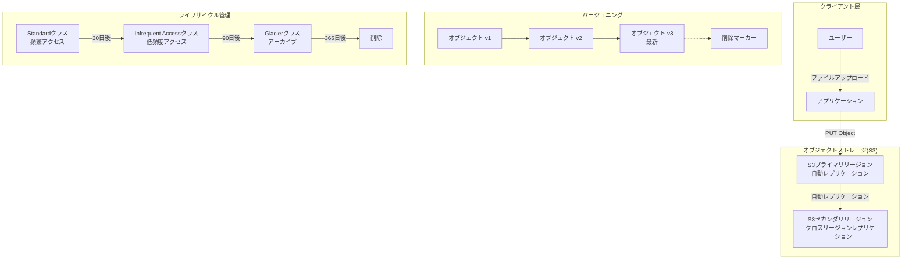

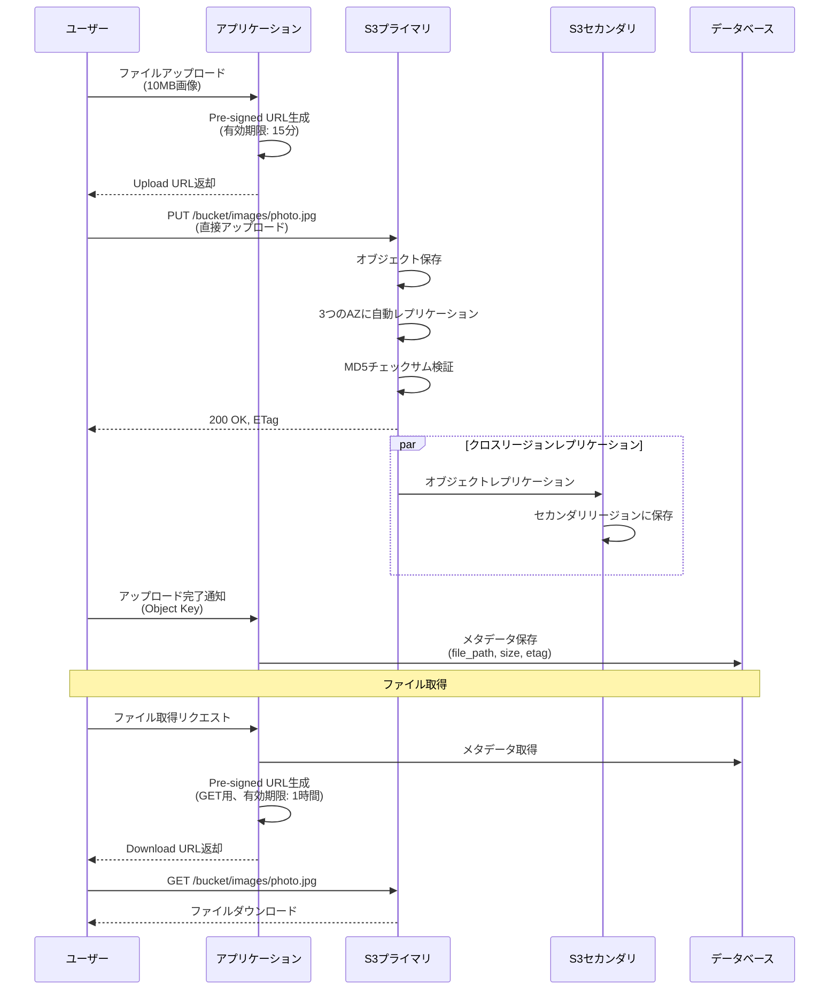

### 設計のポイント

S3の耐久性は99.999999999%(イレブンナイン)です。
バージョニングを有効化して、誤削除や上書きから保護します。
クロスリージョンレプリケーションにより、災害対策を実現します。
Pre-signed URLを使用して、アプリケーションサーバーを経由せずに直接アップロード/ダウンロードします。
ライフサイクルポリシーを設定して、古いデータを自動的に低コストのストレージクラスに移行します。

## リクエストのリトライ設計について

### 概要

一時的なネットワーク障害やサービス過負荷に対応するため、適切なリトライ戦略を実装します。
指数バックオフとジッターを使用して、サーバーへの負荷を分散します。

### システム設計図

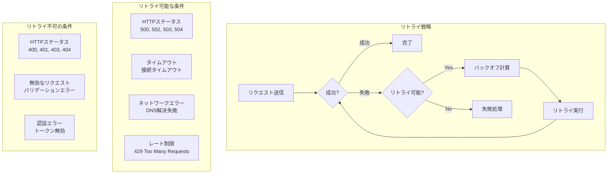

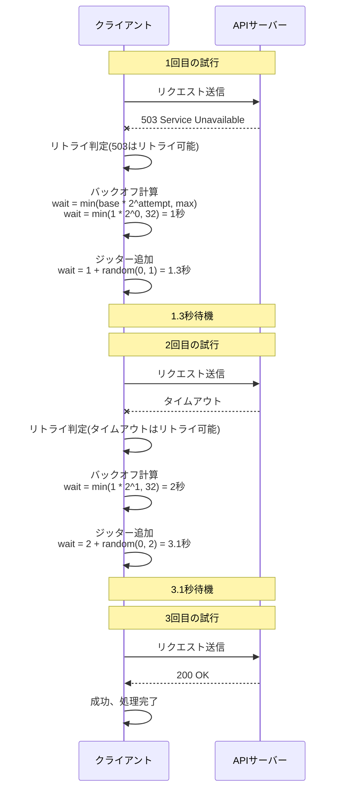

### 設計のポイント

指数バックオフを使用して、リトライ間隔を徐々に延ばします(1秒、2秒、4秒、8秒...)。
ジッターを追加して、複数のクライアントが同時にリトライするのを防ぎます。
最大リトライ回数を設定して、無限ループを防ぎます(例: 3回)。
冪等性を保証して、リトライによる重複処理を安全にします。
リトライ可能なエラーと不可能なエラーを明確に区別します。

## サーキットブレーカーでリトライによる過負荷を防ぐ

### 概要

サーキットブレーカーパターンにより、障害が発生しているサービスへのリクエストを一時的に遮断します。
システム全体の連鎖的な障害を防ぎ、障害からの復旧を促進します。

### システム設計図

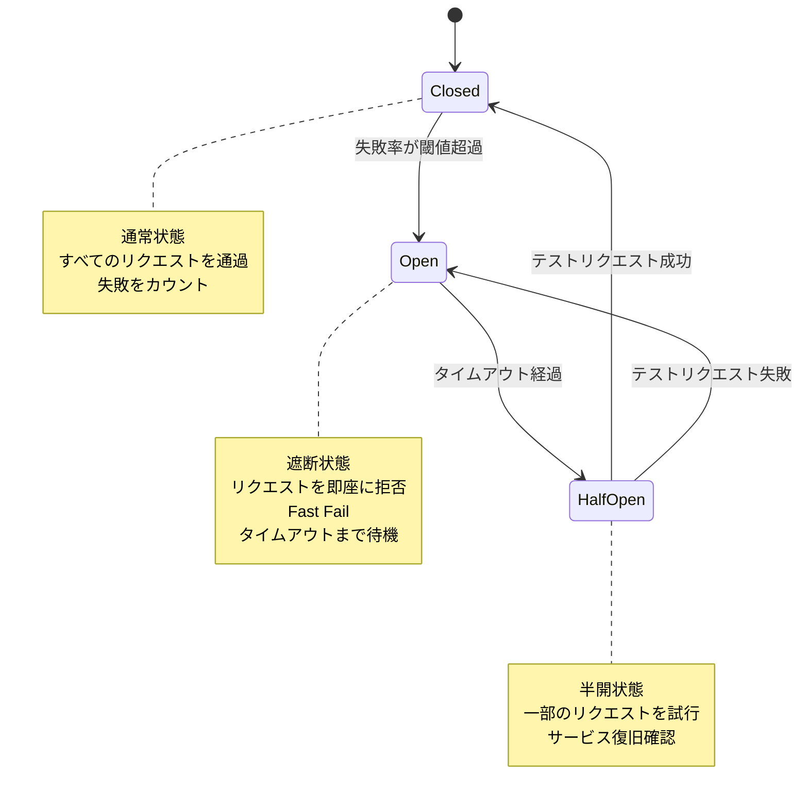

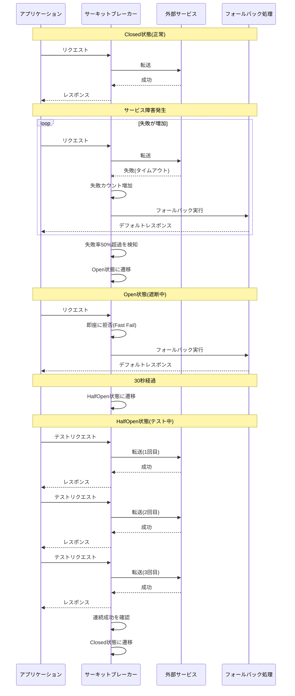

### 設計のポイント

失敗率の閾値は、サービスの特性に応じて設定します(例: 50%)。
Open状態のタイムアウト時間は、サービスの復旧時間を考慮します(例: 30秒)。
フォールバック処理を実装して、サーキットブレーカーOpen時にもユーザーに何らかのレスポンスを返します。
メトリクスを監視して、サーキットブレーカーの状態遷移をダッシュボードで確認できるようにします。
各サービスごとに独立したサーキットブレーカーを設定します。

## メッセージキューによる信頼性向上

### 概要

メッセージキューを使用して、非同期処理の信頼性を向上させます。
メッセージの永続化、リトライ、Dead Letter Queueにより、処理の失敗に対応します。

### システム設計図

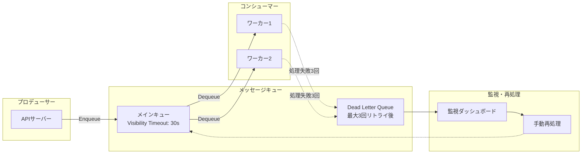

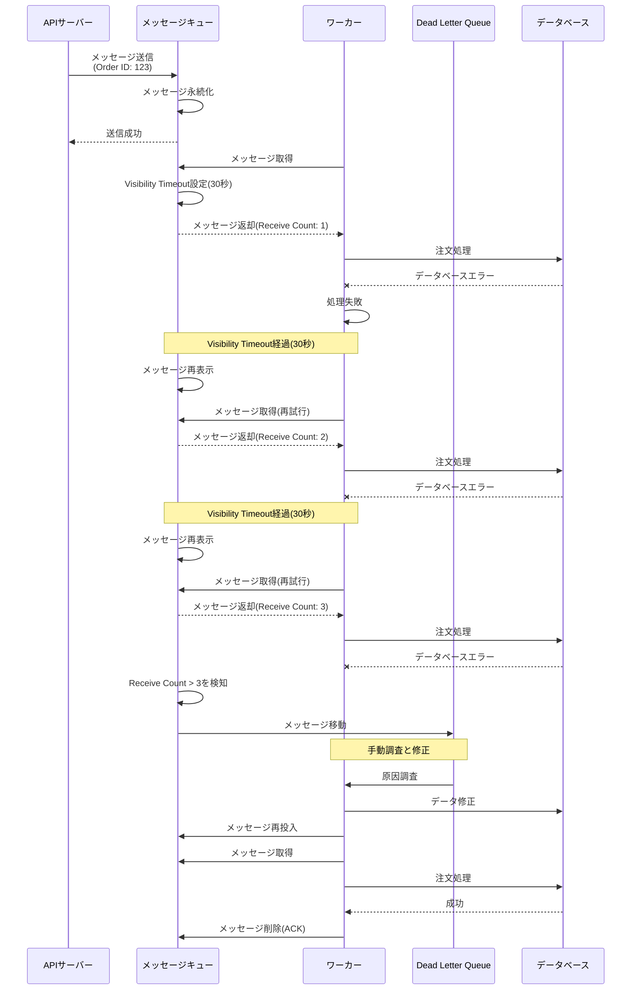

### 設計のポイント

メッセージの永続化により、キューサーバー障害時もメッセージを失いません。
Visibility Timeoutは、処理時間より長く設定します。
Receive Countを監視して、一定回数失敗したメッセージはDLQに移動します。
DLQのメッセージは定期的に確認し、根本原因を解決してから再処理します。
メッセージの順序保証が必要な場合は、FIFOキューを使用します。

## 大量のリクエストを制限する

### 概要

レート制限(Rate Limiting)により、システムを過負荷から保護します。
複数のアルゴリズムを理解し、ユースケースに応じて選択します。

### システム設計図

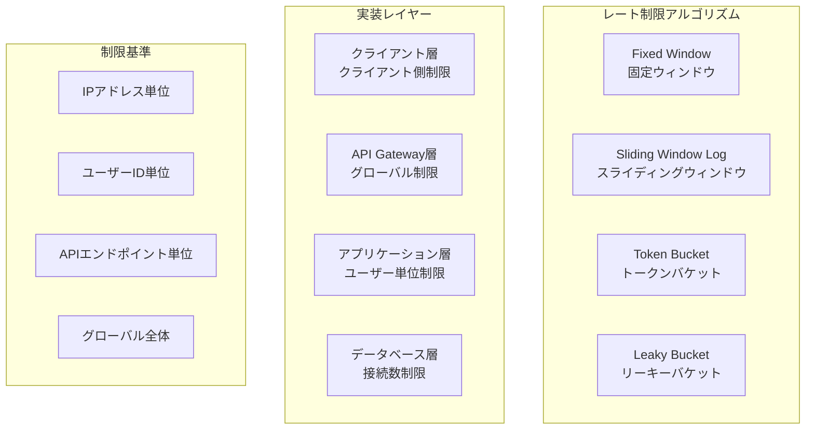

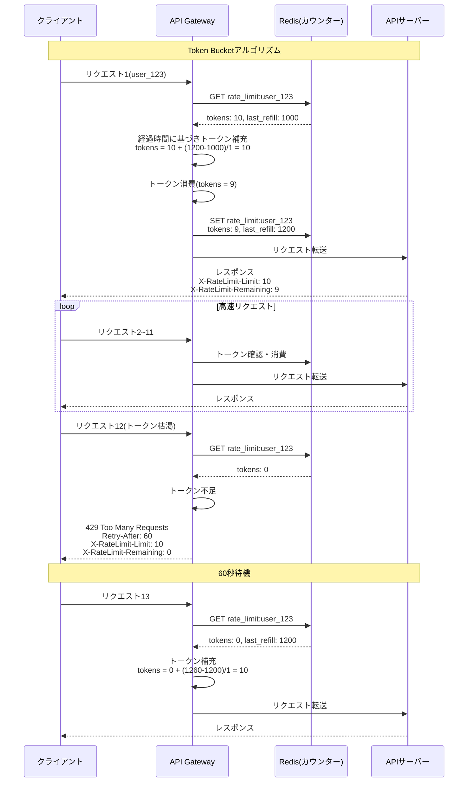

### 設計のポイント

Token Bucketアルゴリズムは、バースト的なトラフィックを許容しながら、長期的なレートを制限します。
Sliding Window Logアルゴリズムは、より正確なレート制限を実現しますが、メモリ使用量が多いです。
レート制限の設定は、APIの種類(読み取り/書き込み)やユーザーのティア(無料/有料)に応じて変更します。
429レスポンスには、Retry-Afterヘッダーを含めて、クライアントに再試行タイミングを伝えます。
分散環境では、Redisなどの共有ストレージを使用してカウンターを管理します。
