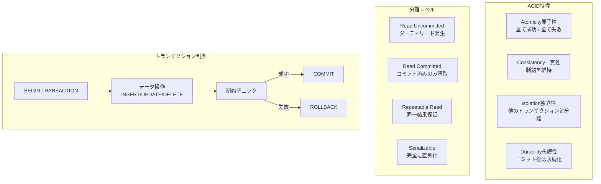
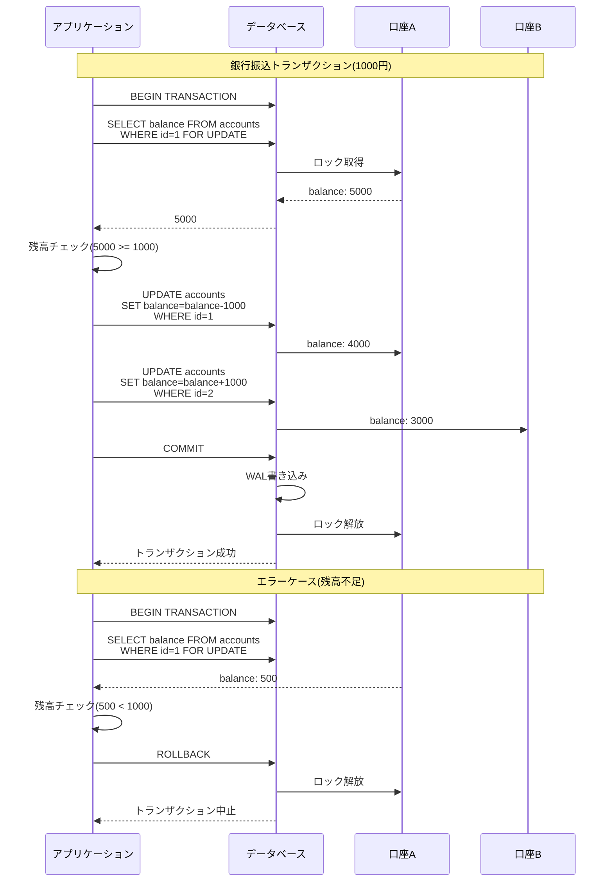
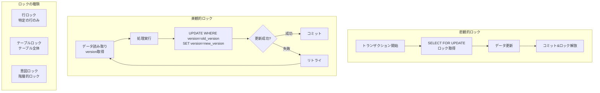
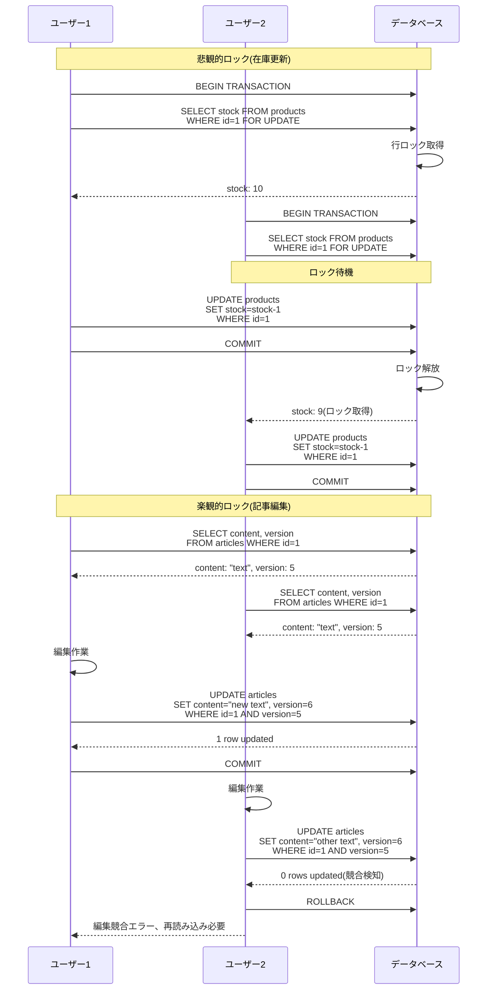
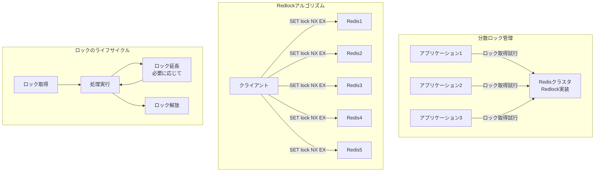
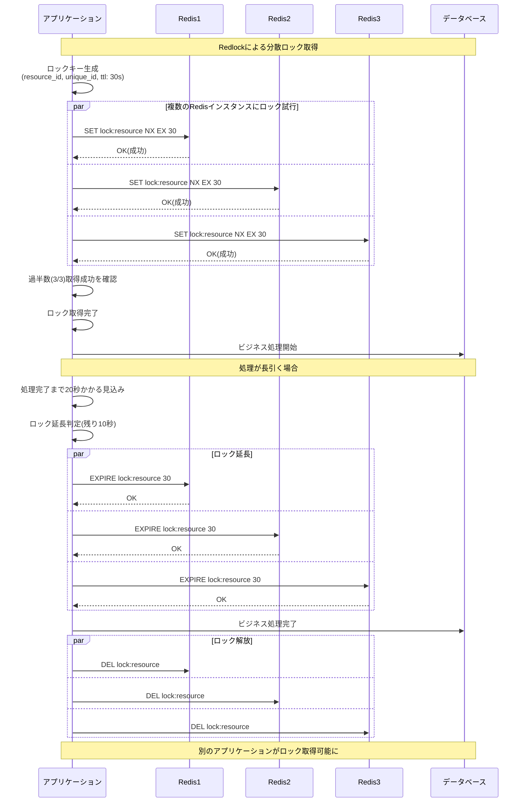
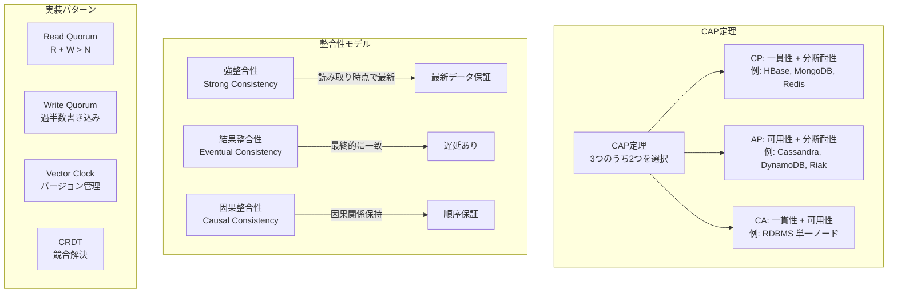
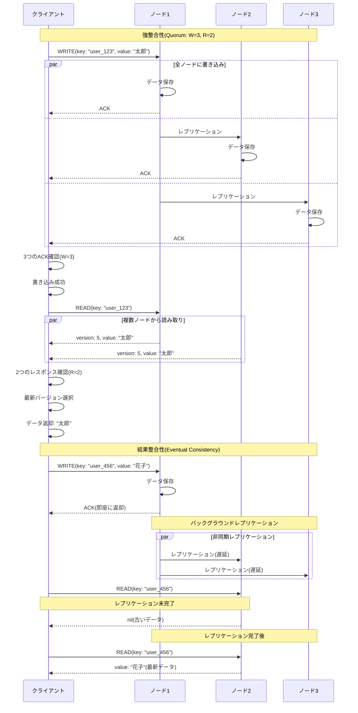
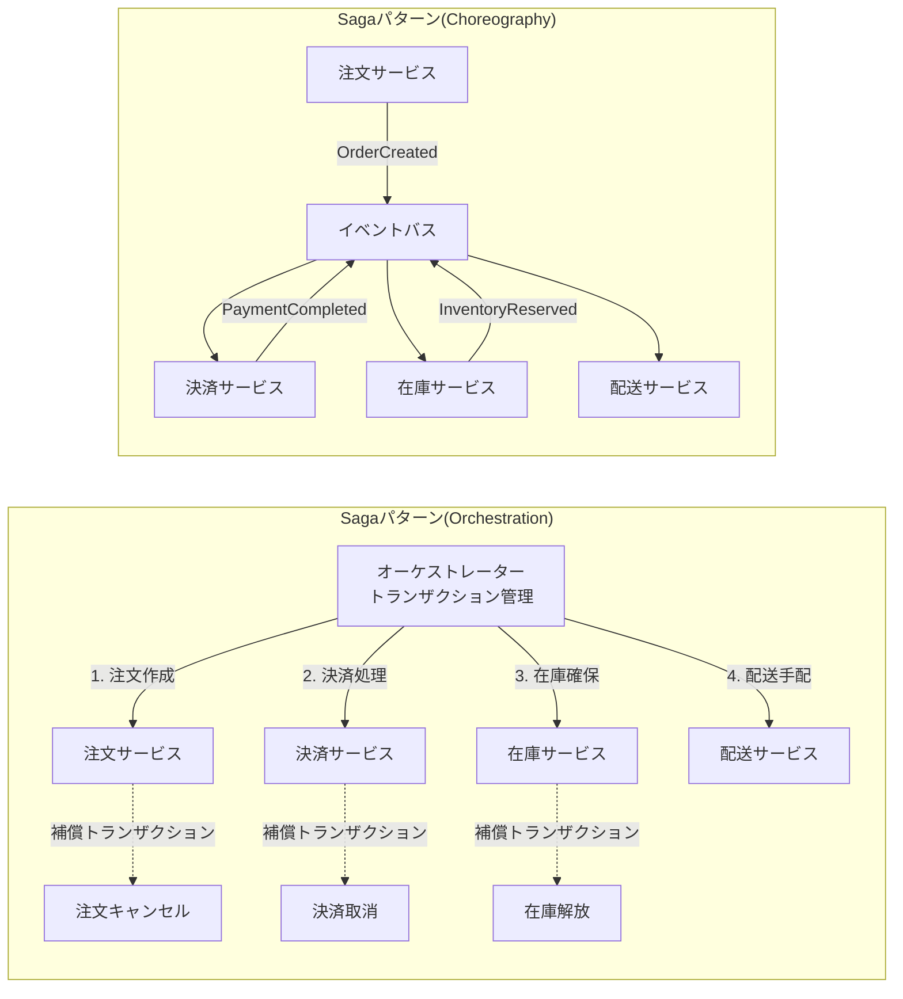
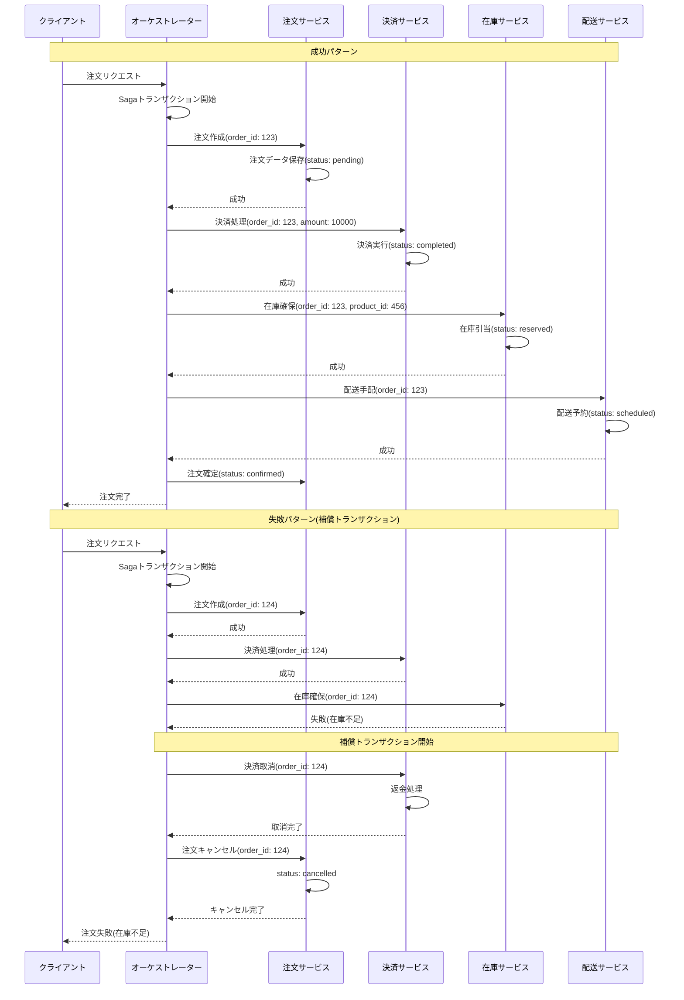

# トランザクション・分散システム設計(Part 1)

## データベーストランザクション

### 概要

トランザクションは、ACID特性(原子性、一貫性、独立性、永続性)を保証する処理の単位です。
複数のデータ操作を1つのまとまりとして扱い、整合性を維持します。

### システム設計図

### 設計のポイント

トランザクションは必要最小限の範囲で使用し、長時間ロックを保持しないようにします。
適切な分離レベルを選択します(多くの場合、Read Committedで十分です)。
デッドロックを避けるため、常に同じ順序でロックを取得します。
トランザクション内でネットワークI/Oや外部APIコールを行わないようにします。
楽観的ロックと悲観的ロックを使い分けます。

## データベースロックを使って排他制御を行う

### 概要

データベースロックにより、複数のトランザクションが同時に同じデータを変更することを防ぎます。
行ロック、テーブルロック、楽観的ロック、悲観的ロックを適切に使い分けます。

### システム設計図

### 設計のポイント

悲観的ロックは、競合が頻繁に発生する場合に使用します(在庫管理等)。
楽観的ロックは、競合が稀な場合に使用します(記事編集等)。
SELECT FOR UPDATEは、更新対象の行のみに使用し、範囲を最小限にします。
デッドロックを検知して自動的にリトライする仕組みを実装します。
ロックのタイムアウト値を設定して、無期限の待機を防ぎます。

## 長時間のトランザクションへ分散共有ロックを活用する

### 概要

長時間にわたるビジネストランザクションでは、データベーストランザクションを長時間保持できません。
分散ロック(Redis、ZooKeeper等)を使用して、アプリケーションレベルでの排他制御を実現します。

### システム設計図

### 設計のポイント

Redlockアルゴリズムは、過半数のRedisインスタンスでロック取得に成功した場合に、ロックが取得できたとみなします。
ロックのTTL(有効期限)は、処理時間より十分長く設定します。
処理中にロックが失効しないよう、必要に応じてロックを延長します。
ロック解放時は、自分が取得したロックのみを解放します(unique_idで確認)。
ロック取得に失敗した場合は、適切なリトライ戦略を実装します。

## CAP定理と整合性モデル

### 概要

CAP定理は、分散システムにおいて、一貫性(Consistency)、可用性(Availability)、分断耐性(Partition tolerance)の3つのうち、2つまでしか同時に満たせないという定理です。
システムの要件に応じて、適切なトレードオフを選択します。

### システム設計図

### 設計のポイント

金融システムなど、強整合性が必要な場合はCP型を選択します。
SNSやコメントシステムなど、可用性が重要な場合はAP型を選択します。
Quorumベースのシステムでは、W + R > Nとすることで強整合性を保証します。
結果整合性を採用する場合、アプリケーションレベルで整合性の遅延を考慮した設計にします。
競合解決戦略(Last Write Wins、Vector Clock等)を明確に定義します。

## マイクロサービス間のトランザクションの整合性を維持する

### 概要

マイクロサービスアーキテクチャでは、サービス間にまたがるトランザクションを分散トランザクションとして扱います。
Sagaパターンを使用して、結果整合性を保ちながらビジネストランザクションを実現します。

### システム設計図

### 設計のポイント

各サービスのローカルトランザクションで処理を完了し、結果整合性を保ちます。
補償トランザクション(undo操作)を必ず実装して、ロールバックを可能にします。
Orchestrationパターンは、中央制御で管理しやすいですが、単一障害点になる可能性があります。
Choreographyパターンは、サービス間の疎結合を保ちますが、フロー全体の把握が難しくなります。
イベントの順序保証が必要な場合は、メッセージキューの順序保証機能を使用します。
