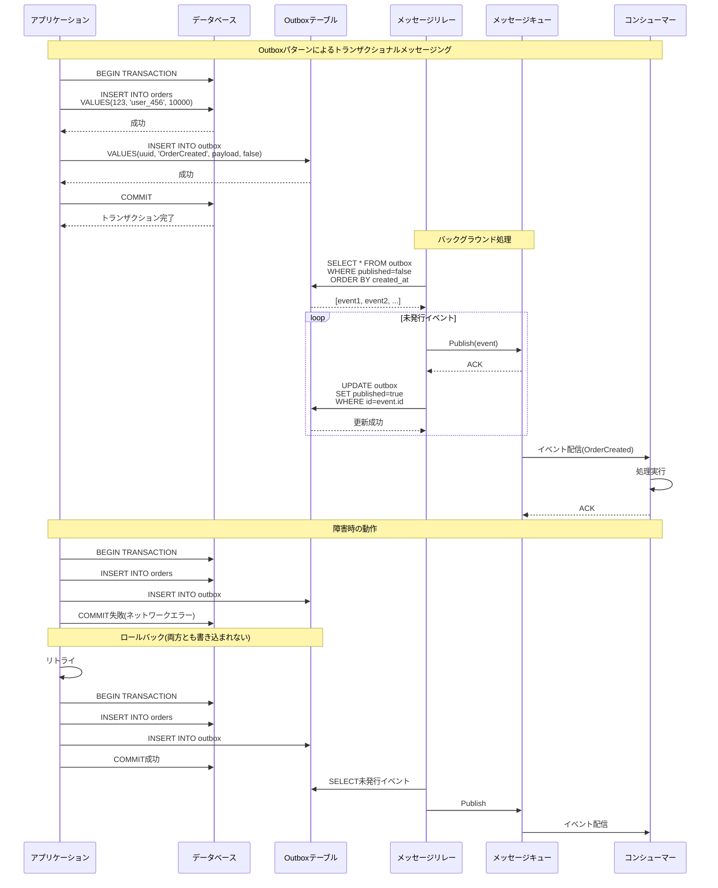
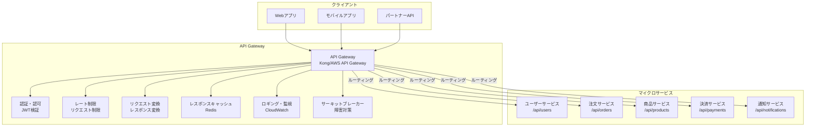
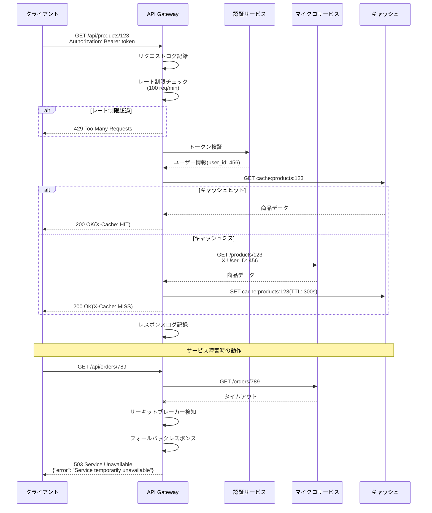
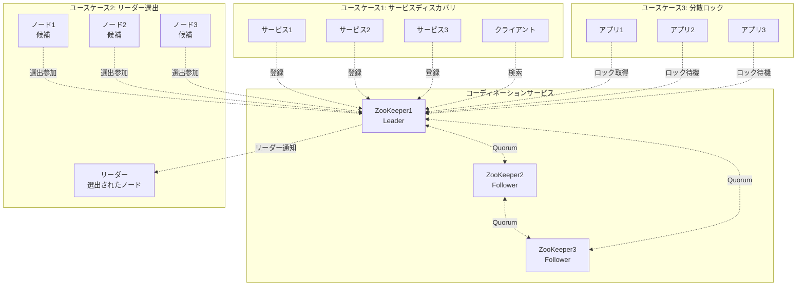
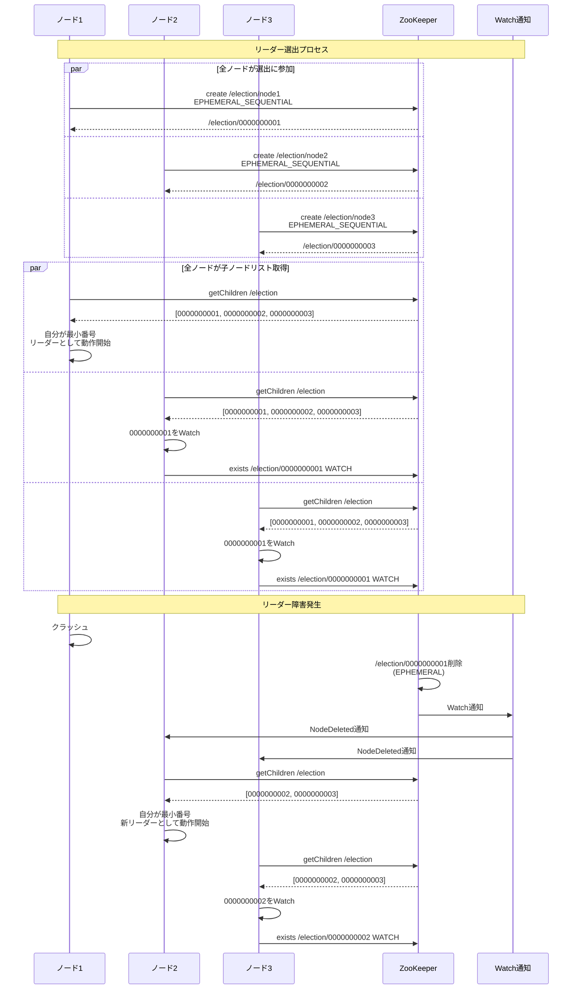
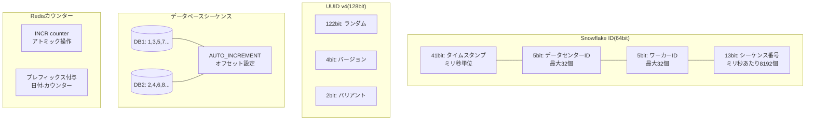
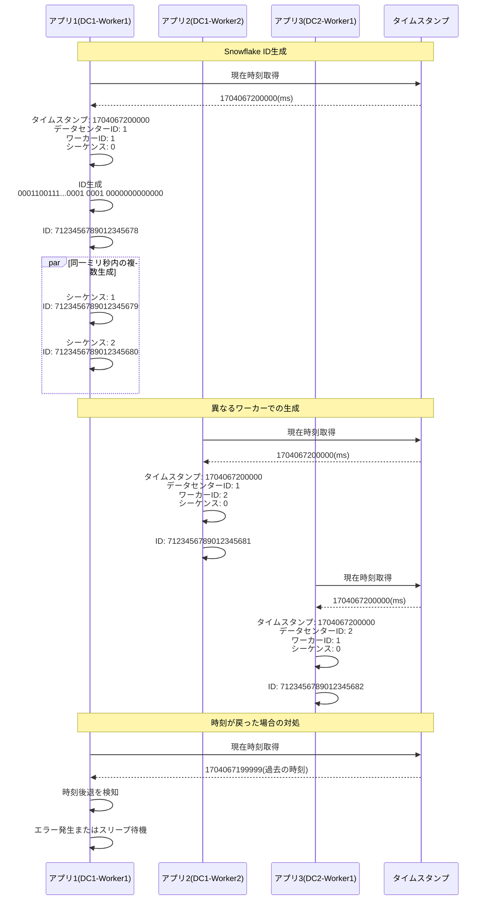
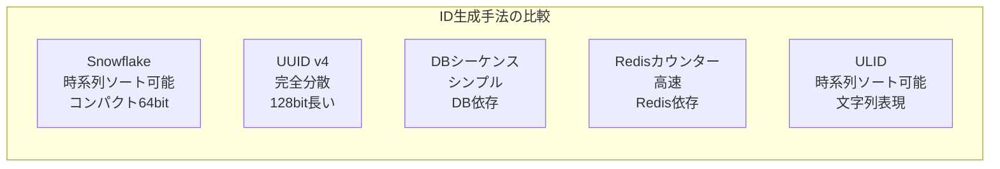

```mermaid
graph TB
    subgraph "Outboxパターン"
        App[アプリケーション]
        DB[(データベース)]
        OutboxTable[(Outboxテーブル)]
        Relay[メッセージリレー<br/>CDC/ポーリング]
        MessageQueue[メッセージキュー]
        
        App -->|1. トランザクション開始| DB
        App -->|2. ビジネスデータ書き込み| DB
        App -->|3. Outboxレコード挿入| OutboxTable
        App -->|4. コミット| DB
        
        OutboxTable -->|5. 変更検知| Relay
        Relay -->|6. メッセージ発行| MessageQueue
        Relay -->|7. 発行済みフラグ更新| OutboxTable
    end
    
    subgraph "CDC(Change Data Capture)"
        DBLog[データベースログ<br/>Binlog/WAL]
        Debezium[Debezium<br/>CDC コネクター]
        Kafka[Kafkaトピック]
        
        DBLog --> Debezium
        Debezium --> Kafka
    end
    
    subgraph "ポーリング方式"
        Scheduler[スケジューラー<br/>定期実行]
        SelectOutbox[SELECT * FROM outbox<br/>WHERE published=false]
        Publish[メッセージ発行]
        UpdateOutbox[UPDATE outbox<br/>SET published=true]
        
        Scheduler --> SelectOutbox
        SelectOutbox --> Publish
        Publish --> UpdateOutbox
    end
```

# トランザクション・分散システム設計(Part 2)

## メッセージキューとデータベースの書き込みを同一のトランザクション内で実行する

### 概要

データベースへの書き込みとメッセージキューへの発行を同時に行う場合、両方が成功または両方が失敗することを保証する必要があります。
Outboxパターンを使用して、トランザクショナルメッセージングを実現します。

### システム設計図

### 設計のポイント

Outboxテーブルとビジネステーブルを同一トランザクションで更新することで、原子性を保証します。
メッセージリレーは、CDCまたはポーリングでOutboxテーブルを監視します。
CDCは低レイテンシですが、データベースの変更ログに依存します。
ポーリングはシンプルですが、レイテンシが高くなります。
メッセージの重複配信を考慮して、コンシューマー側で冪等性を保証します。
Outboxテーブルの古いレコードは定期的に削除します。

## API Gatewayでマイクロサービスの入口を作る

### 概要

API Gatewayは、クライアントとマイクロサービス群の間に配置され、ルーティング、認証、レート制限、ロギングなどを一元管理します。
バックエンドサービスの複雑さをクライアントから隠蔽します。

### システム設計図

### 設計のポイント

API Gatewayは水平スケールして、単一障害点にならないようにします。
認証トークンの検証をGatewayで行い、バックエンドサービスの負荷を軽減します。
GraphQL Gatewayを使用することで、複数のマイクロサービスからデータを集約できます。
BFF(Backend for Frontend)パターンを適用して、クライアントごとに最適化されたAPIを提供します。
API GatewayとService Meshを組み合わせることで、包括的な制御を実現します。

## コーディネーションサービスを活用した分散システムの管理

### 概要

ZooKeeperやetcdなどのコーディネーションサービスを使用して、分散システムの設定管理、サービスディスカバリ、リーダー選出を行います。
強整合性を保ちながら、複数のノード間で情報を共有します。

### システム設計図

### 設計のポイント

ZooKeeperは、ZAB(ZooKeeper Atomic Broadcast)プロトコルにより、強整合性を保証します。
Ephemeralノードを使用することで、クライアントのセッション切断時に自動的にノードが削除されます。
Watchメカニズムにより、データ変更を即座に検知できます。
Quorumベースの動作により、過半数のノードが生存していれば動作し続けます。
リーダー選出は、シーケンシャルノードの番号で判定し、公平性を保ちます。

## 分散システムでユニークIDを設計する

### 概要

分散システムでは、複数のサーバーで同時にIDを生成する必要があります。
Snowflake、UUID、データベースシーケンス、Redisカウンターなど、様々な手法を理解し、要件に応じて選択します。

### システム設計図

### 設計のポイント

Snowflake IDは、時系列でソート可能で、64bitとコンパクトです。
UUIDは、完全に分散して生成できますが、128bitと長く、ランダムなためインデックス効率が悪いです。
データベースシーケンスは、シンプルですが、データベースがボトルネックになります。
Redisカウンターは、高速ですが、Redisへの依存とネットワークレイテンシが課題です。
時刻同期の問題を考慮し、NTPで時刻を正確に保ちます。
ワーカーIDの管理は、環境変数や設定ファイルで行います。
