# アプリケーション設計パターン

## ファイルをオブジェクトストレージにアップロードする

### 概要

大容量ファイルをアップロードする際は、Pre-signed URLを使用してアプリケーションサーバーを経由せずに直接S3にアップロードします。
マルチパートアップロードにより、大きなファイルを分割して並列アップロードし、パフォーマンスと信頼性を向上させます。

### システム設計図

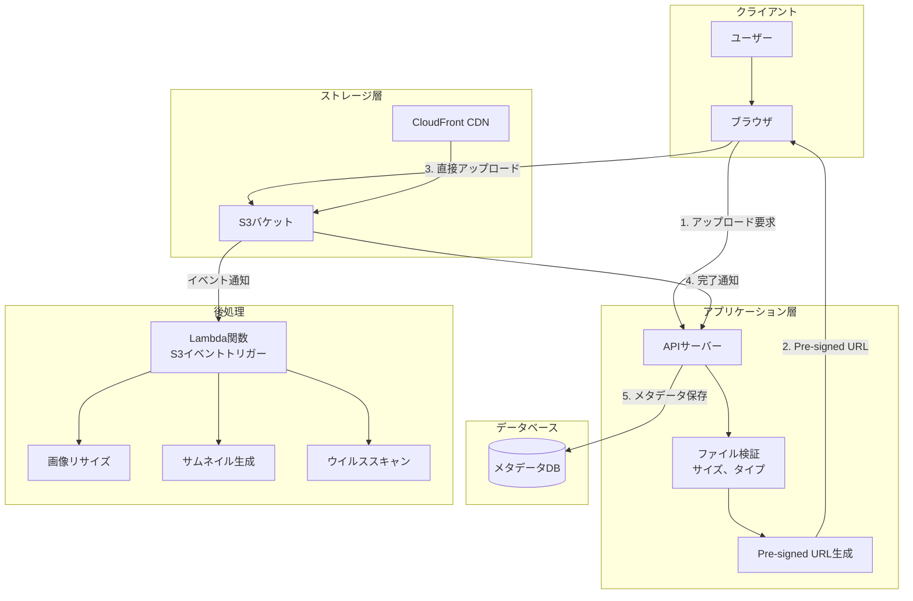

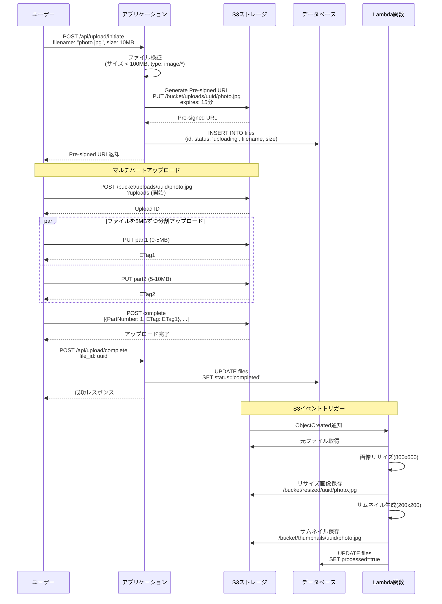

### 設計のポイント

Pre-signed URLにより、アプリケーションサーバーの負荷を削減し、直接S3にアップロードします。
マルチパートアップロードにより、大きなファイルを効率的にアップロードできます。
ファイルのバリデーション(サイズ、タイプ、拡張子)をサーバー側で実行します。
S3のライフサイクルポリシーを設定して、一時ファイルを自動削除します。
アップロード完了後の後処理(画像リサイズ、ウイルススキャン等)は非同期で実行します。

## 遅延キューを使って処理を遅らせる

### 概要

遅延キュー(Delay Queue)を使用して、指定した時間後に処理を実行します。
リマインダー、予約投稿、一時的なアカウントロックの解除などに活用します。

### システム設計図

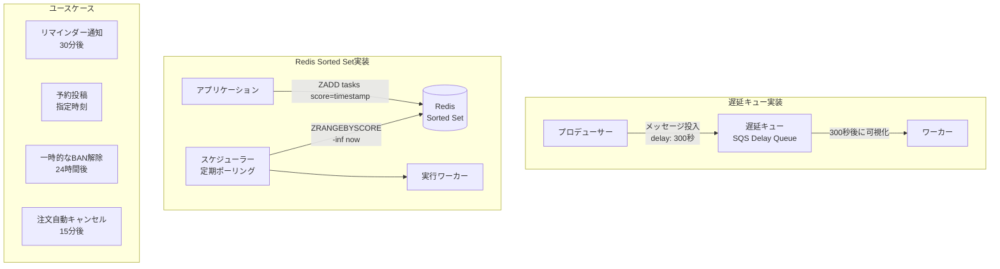

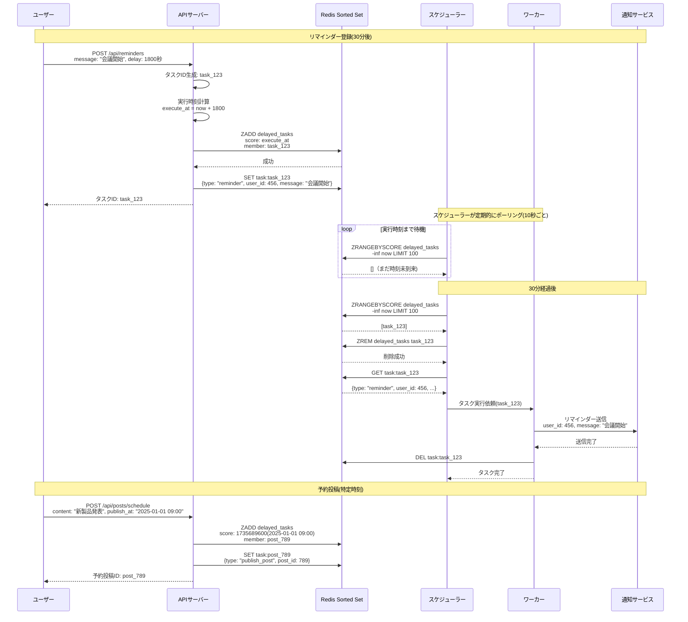

### 設計のポイント

SQS Delay Queueは、最大15分までの遅延をサポートします。
それ以上の遅延が必要な場合は、Redis Sorted SetやDynamoDB TTLを使用します。
スケジューラーは複数インスタンスで実行して可用性を確保し、分散ロックで重複実行を防ぎます。
タスクの実行失敗時は、リトライポリシーを設定します。
タスクのキャンセル機能を実装して、不要になったタスクを削除できるようにします。

## ページネーションを設計する

### 概要

大量のデータを効率的に取得するため、ページネーションを実装します。
オフセットベース、カーソルベース、キーセットページネーションの特性を理解し、適切に選択します。

### システム設計図

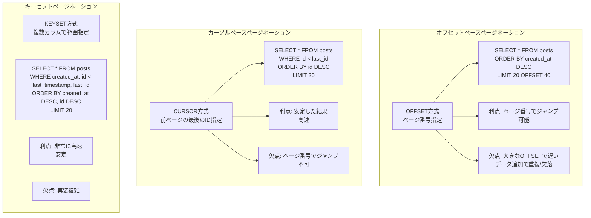

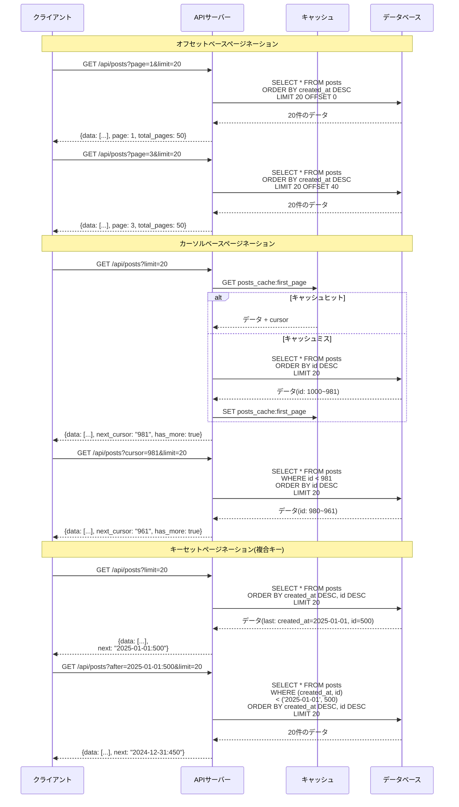

### 設計のポイント

オフセットベースは、ページ番号でのジャンプが必要な場合に使用します(検索結果等)。
カーソルベースは、無限スクロールやフィードに適しています。
キーセットページネーションは、大規模データで高速な取得が必要な場合に使用します。
総件数の取得は、COUNT(*)クエリがコストが高いため、キャッシュまたは概算値を使用します。
ページネーションのメタデータ(has_more、total_pages等)を適切に返却します。

## 全文検索を導入する

### 概要

全文検索エンジン(Elasticsearch、Algolia等)を使用して、高速で柔軟な検索機能を実現します。
データベースのLIKE検索では性能が出ない場合に導入します。

### システム設計図

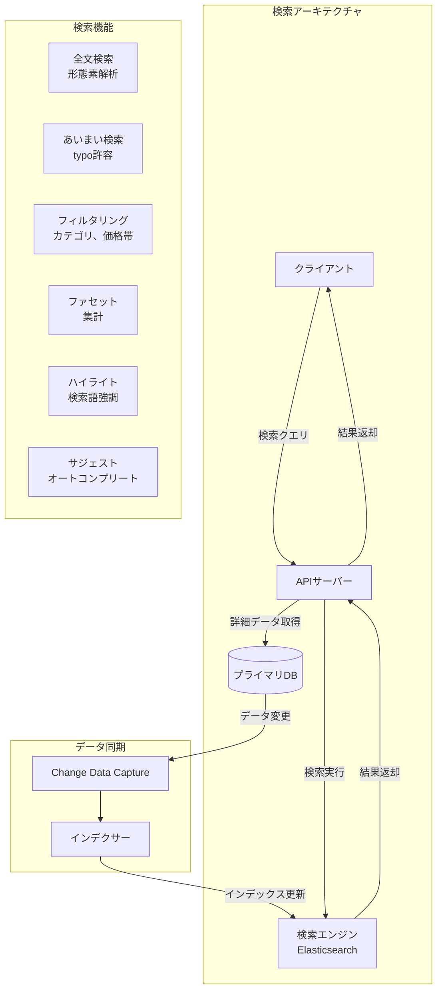

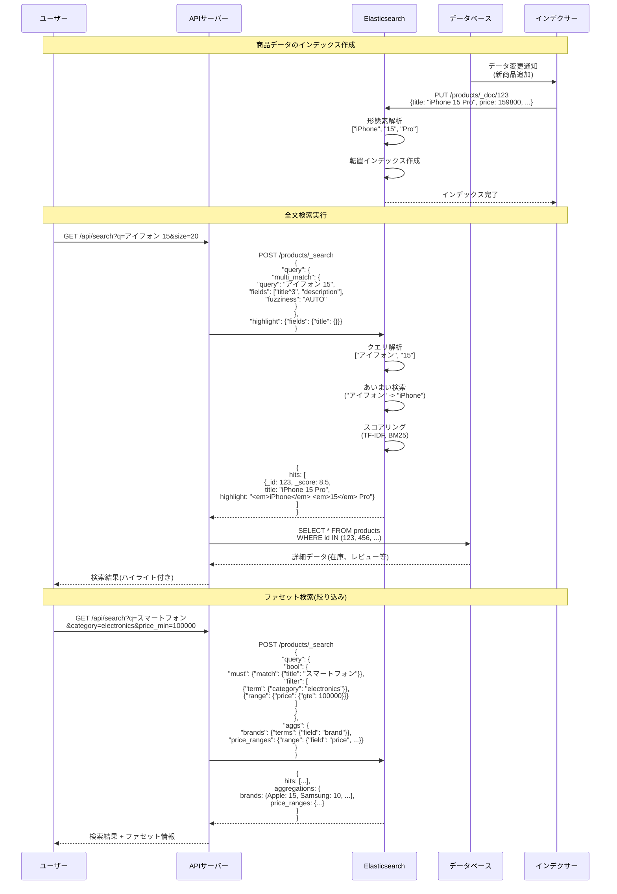

### 設計のポイント

データベースとElasticsearchの同期は、CDCまたはアプリケーションレイヤーで実装します。
Elasticsearchはプライマリデータソースではなく、検索専用として使用します。
日本語の形態素解析には、kuromoji analyzerを使用します。
検索結果のスコアリングアルゴリズム(TF-IDF、BM25)を理解し、適切に調整します。
ファセット検索により、ユーザーが結果を絞り込みやすくします。
インデックスのシャーディングとレプリケーションで、スケーラビリティと可用性を確保します。

## ユーザーを認証・認可する

### 概要

JWT(JSON Web Token)を使用して、ステートレスな認証・認可を実現します。
OAuth 2.0とOpenID Connectにより、サードパーティ認証を統合します。

### システム設計図

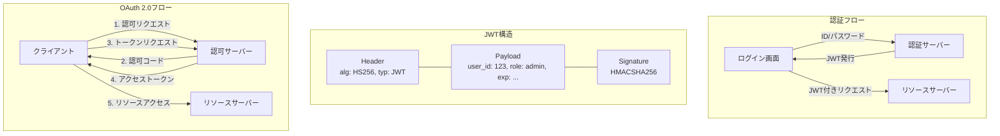

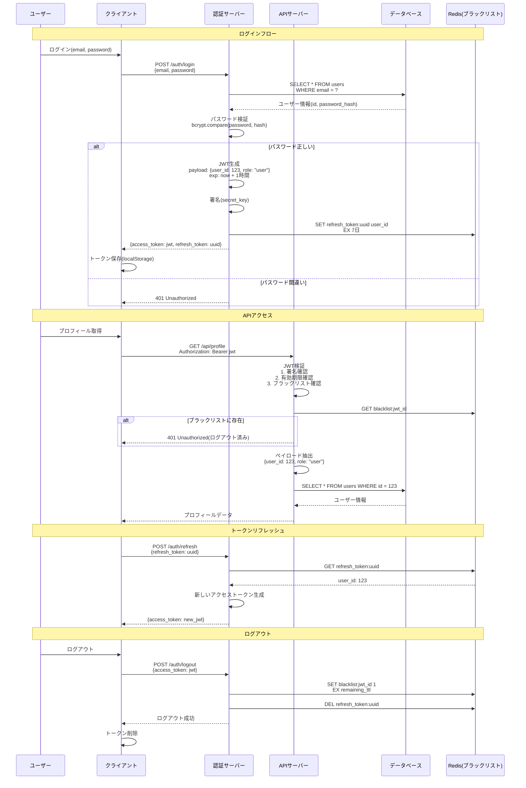

### 設計のポイント

パスワードは必ずハッシュ化(bcrypt、argon2)して保存します。
JWTのペイロードには機密情報を含めません(Base64エンコードで可読)。
アクセストークンは短い有効期限(15分~1時間)、リフレッシュトークンは長い有効期限(7日~30日)を設定します。
ログアウト時は、JWTをブラックリストに追加します(Redis、有効期限まで保持)。
RBAC(Role-Based Access Control)またはABAC(Attribute-Based Access Control)で認可を実装します。
CSRF対策として、SameSite cookieまたはCSRFトークンを使用します。

## SaaSのマルチテナントを設計する

### 概要

マルチテナントアーキテクチャにより、複数の顧客(テナント)が同じアプリケーションインスタンスを共有します。
データ分離、セキュリティ、リソース分離の方法を適切に選択します。

### システム設計図

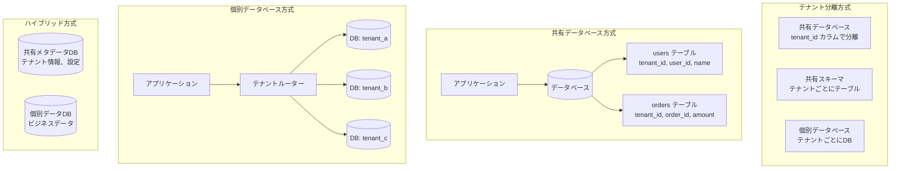

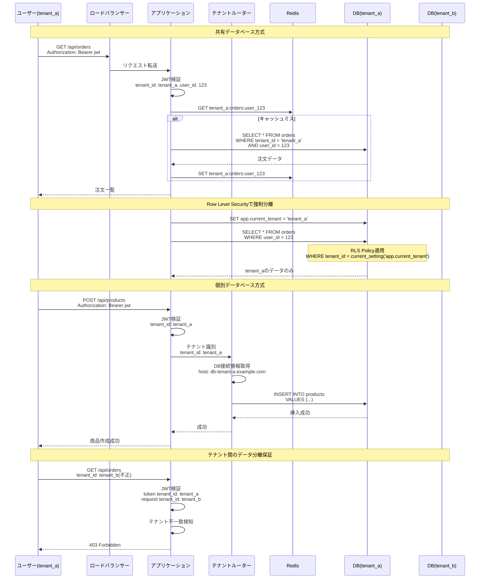

### 設計のポイント

共有データベース方式は、コスト効率が高いですが、テナント間のデータ漏洩リスクがあります。
個別データベース方式は、完全な分離を実現しますが、運用コストが高くなります。
Row Level Security(RLS)を使用して、データベースレベルでテナント分離を強制します。
テナントIDは、JWTに含め、すべてのクエリで必ずフィルタリングします。
テナントごとのリソース使用量を監視して、公平なリソース配分を実現します(Rate Limiting等)。
大口顧客には個別データベースを割り当て、小規模顧客は共有データベースを使用するハイブリッド方式も有効です。
