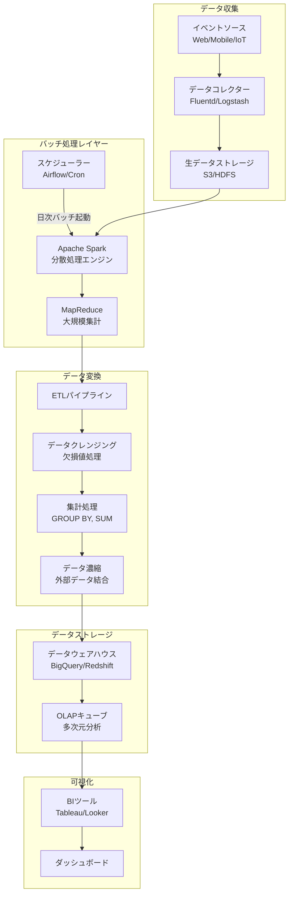
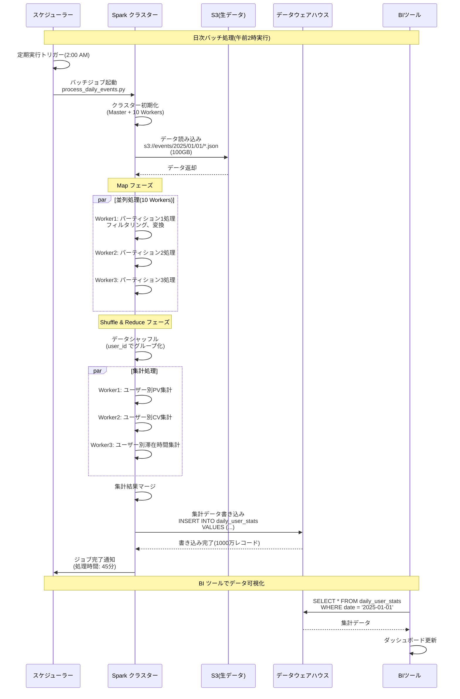
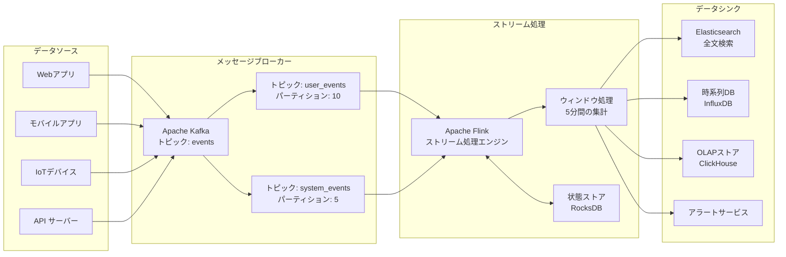
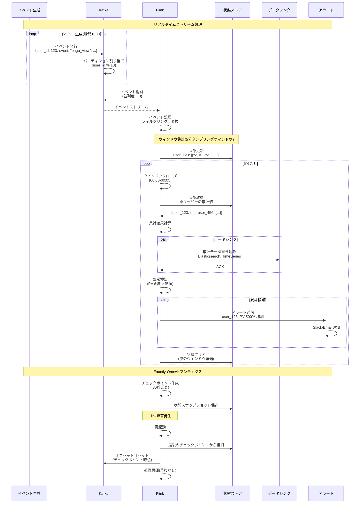
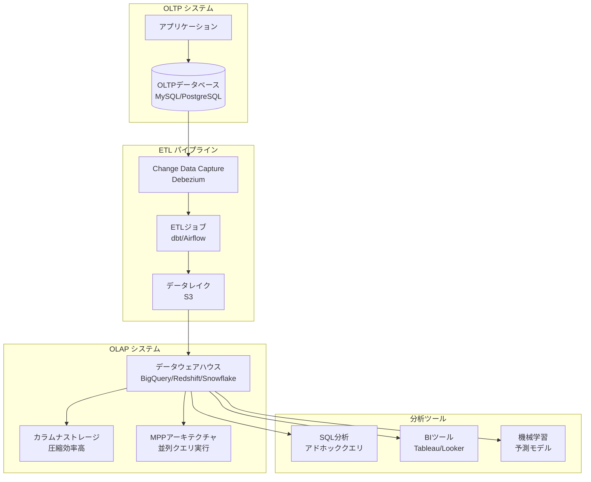
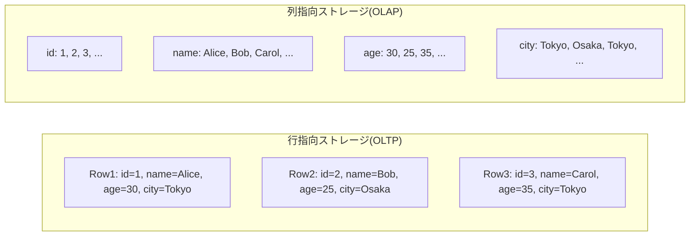
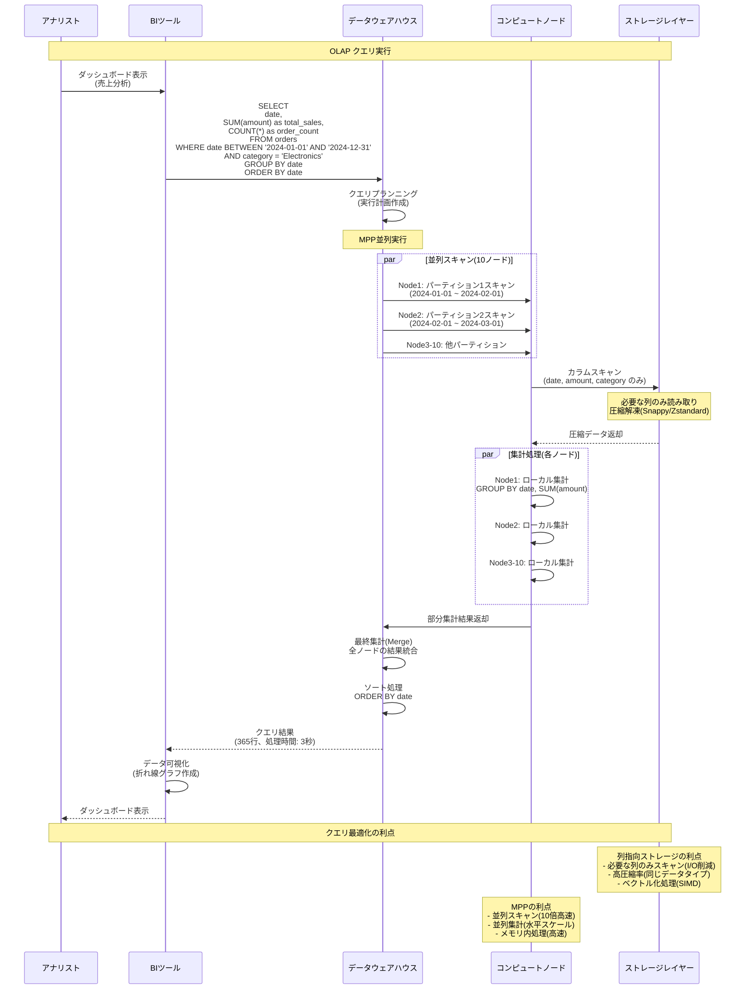

# ビッグデータ処理設計

## 大量のイベントデータをバッチ処理する

### 概要

大量のイベントデータを定期的にバッチ処理することで、集計やレポート生成を効率的に実行します。
Lambda Architecture または Kappa Architecture を採用し、バッチレイヤーとスピードレイヤーを組み合わせます。

### システム設計図

### 設計のポイント

データパーティショニング(日付、ユーザーID等)により、処理対象データを絞り込みます。
Sparkのメモリ内処理により、MapReduceより高速に処理できます。
増分処理(Incremental Processing)を実装して、新しいデータのみを処理します。
バッチ処理の失敗時は、自動リトライと通知機能を実装します。
データスキーマの進化に対応するため、スキーマレジストリを使用します。
処理時間を監視して、SLA(Service Level Agreement)を満たすように最適化します。

## 大量のイベントデータをストリーム処理する

### 概要

リアルタイムでイベントデータを処理することで、即座に分析やアラートを実行します。
Apache Kafka、Apache Flink、Kinesis等のストリーム処理基盤を使用します。

### システム設計図

### 設計のポイント

ウィンドウ処理(Tumbling、Sliding、Session)を使用して、時間範囲内のイベントを集計します。
Exactly-Onceセマンティクスにより、イベントの重複処理や欠落を防ぎます。
状態ストアを使用して、ストリーム処理中の中間状態を保持します。
バックプレッシャー機能により、処理速度を調整して、メモリオーバーフローを防ぎます。
チェックポイント機能により、障害発生時に一貫性のある状態から復旧します。
遅延到着データ(Late Data)に対応するため、Watermarkを設定します。

## アナリティクス用のデータベースを活用する

### 概要

OLTP(Online Transaction Processing)とOLAP(Online Analytical Processing)を分離し、分析専用のデータベースを活用します。
カラムナストレージ、MPP(Massively Parallel Processing)により、大規模データの高速クエリを実現します。

### システム設計図

### 設計のポイント

OLTPとOLAPを分離して、トランザクション処理と分析処理の相互影響を防ぎます。
カラムナストレージにより、集計クエリで必要な列のみをスキャンします。
パーティショニング(日付、地域等)により、スキャン範囲を絞り込みます。
マテリアライズドビューを使用して、頻繁に実行されるクエリを事前計算します。
クエリキャッシュにより、同じクエリの再実行を高速化します。
データの圧縮(Snappy、Zstandard)により、ストレージコストとI/Oを削減します。
クエリコストを監視して、高コストなクエリを最適化します。
