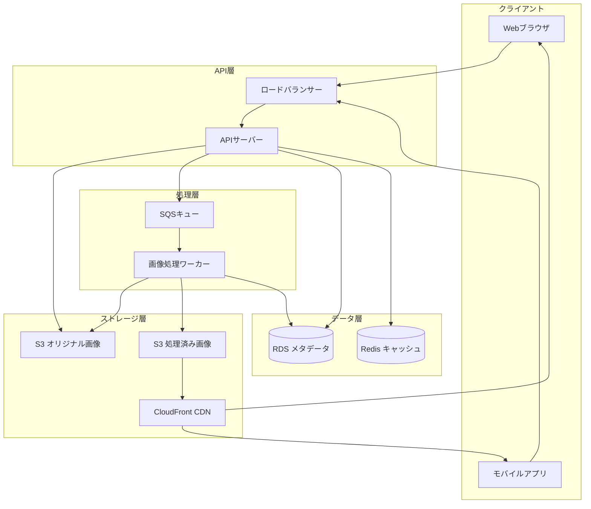
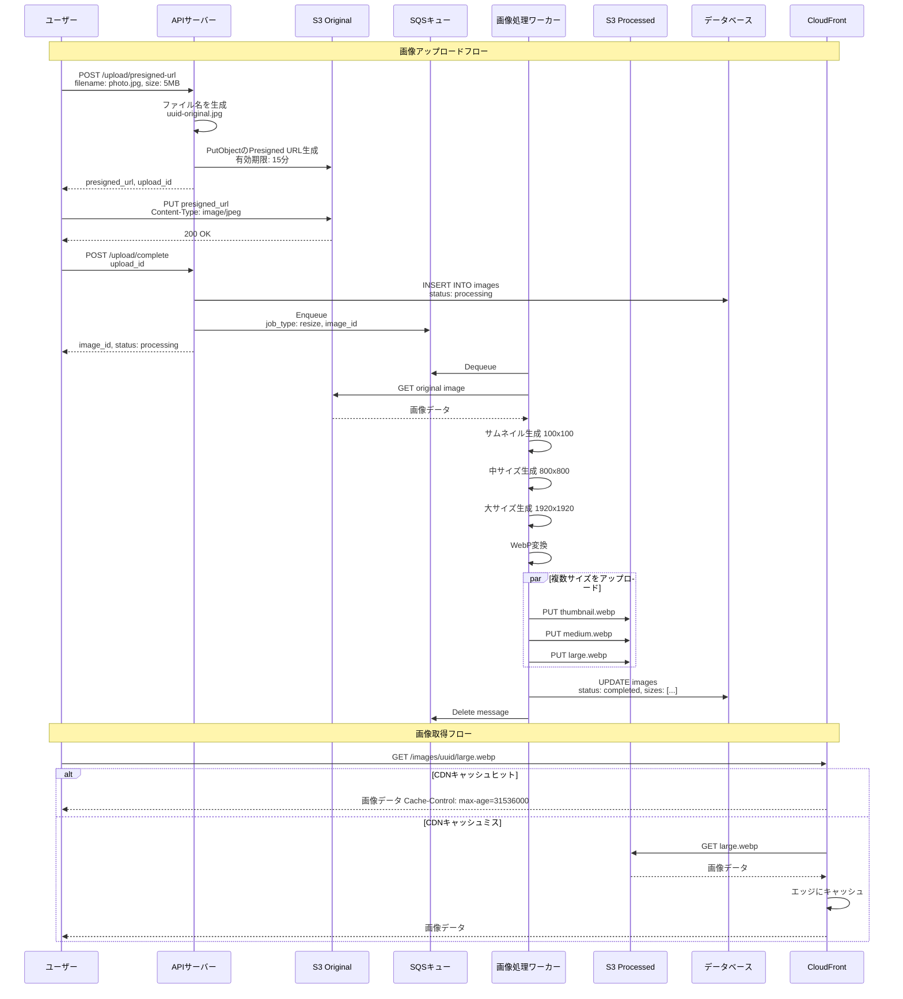
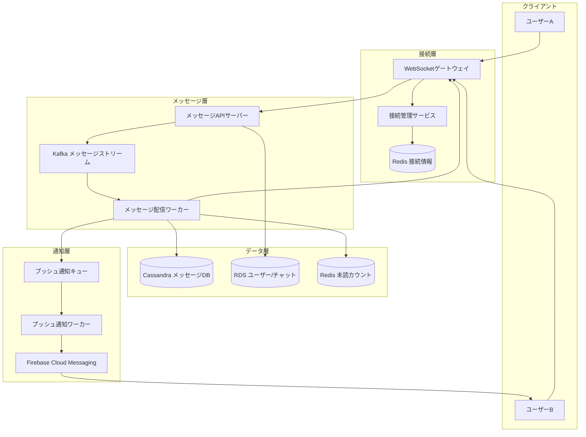
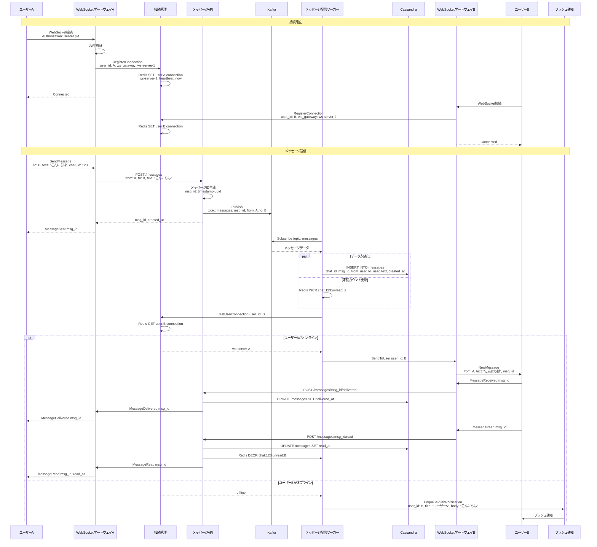
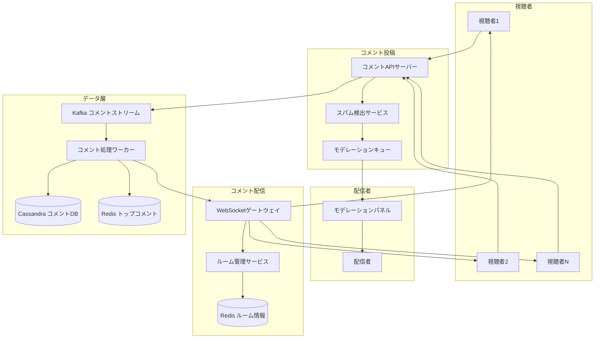
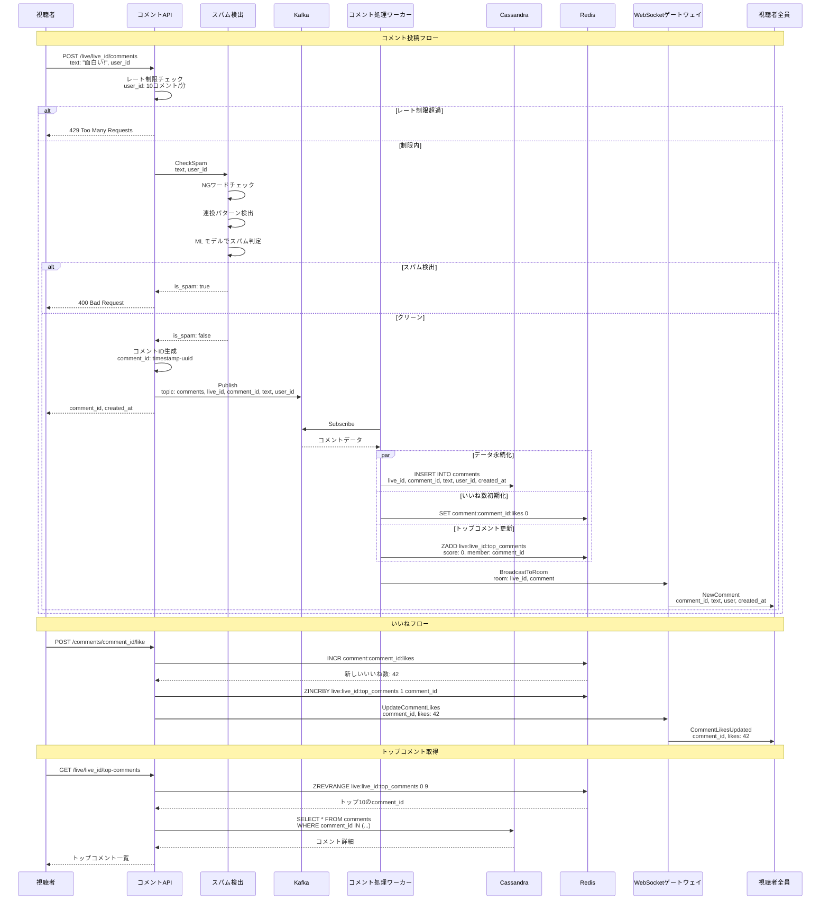
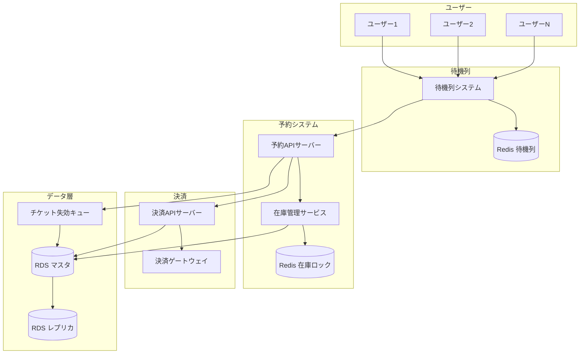
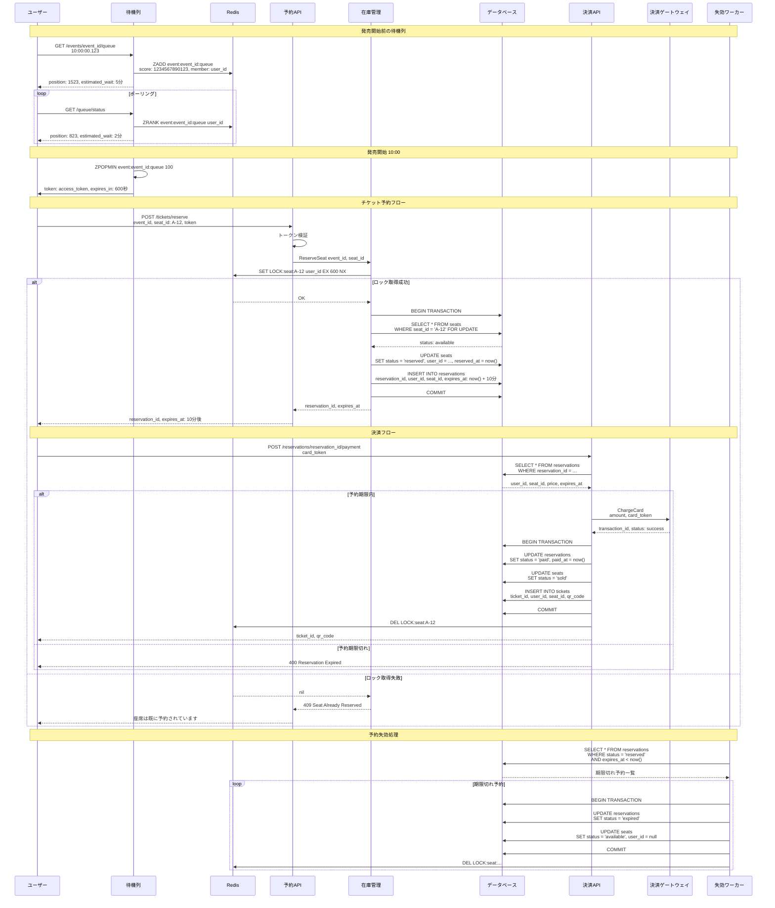

# 応用問題 Part 1

システム設計の応用問題として、実際のサービスを題材にした設計を行います。

## 画像アップロードサービスの設計

### 概要

画像のアップロード、保存、配信を効率的に行うサービスを設計します。
画像の変換処理、CDNによる配信、メタデータ管理を含む完全なシステムを構築します。

### システム設計図

### 設計のポイント

Presigned URLを使用して、クライアントから直接S3にアップロードすることで、APIサーバーの負荷を軽減します。
画像処理を非同期で行い、複数のサイズとフォーマットを生成することで、デバイスに最適な画像を配信します。
CloudFront CDNを使用して、世界中のユーザーに低レイテンシで画像を配信します。
WebPフォーマットを使用することで、画像サイズを30-50%削減します。
メタデータをRDSで管理し、画像の検索や分類を可能にします。
オリジナル画像は別バケットで保存し、削除や再処理に備えます。

## リアルタイムチャットの設計

### 概要

数億ユーザーをサポートするリアルタイムチャットシステムを設計します。
WebSocket接続管理、メッセージ配信、既読管理、オフラインメッセージ配信を含みます。

### システム設計図

### 設計のポイント

WebSocketゲートウェイを水平スケールさせ、数百万の同時接続をサポートします。
接続情報をRedisで管理し、どのゲートウェイサーバーにユーザーが接続しているか追跡します。
Kafkaを使用してメッセージを非同期に処理し、高スループットを実現します。
Cassandraを使用してメッセージを時系列で効率的に保存し、チャット履歴を高速に取得します。
未読カウントをRedisで管理し、リアルタイムに更新します。
オフラインユーザーにはプッシュ通知を送信し、メッセージの見逃しを防ぎます。
メッセージの配信確認と既読確認を実装し、主要チャットアプリと同様のUXを提供します。

## 動画配信ライブコメントサービスの設計

### 概要

リアルタイムで大量のコメントを処理し、視聴者に配信するシステムを設計します。
スパム対策、モデレーション、コメントのランキングを含みます。

### システム設計図

### 設計のポイント

Kafkaを使用してコメントを非同期に処理し、秒間数万件のコメントをサポートします。
WebSocketで視聴者にリアルタイムにコメントを配信します。
スパム検出サービスでNGワード、連投パターン、MLモデルによる判定を行います。
レート制限により、ユーザーごとのコメント投稿頻度を制限します。
Redisのソート済みセットを使用して、いいね数によるトップコメントをリアルタイムに更新します。
Cassandraを使用してコメントを時系列で保存し、配信終了後のアーカイブ視聴でも取得できるようにします。
配信者用のモデレーションパネルで、不適切なコメントを削除できるようにします。

## チケット予約サービスの設計

### 概要

コンサートやイベントのチケット予約システムを設計します。
在庫管理、同時予約の競合解決、決済処理、公平性の担保が重要です。

### システム設計図

### 設計のポイント

待機列システムを実装し、アクセス集中時にサーバー負荷を制御します。Redisのソート済みセットで先着順を公平に管理します。
分散ロックRedisとデータベーストランザクションの二重チェックで、同時予約の競合を防ぎます。
予約に10分の期限を設け、決済されない場合は自動的に座席を開放します。
ワーカープロセスで定期的に期限切れ予約を検出し、座席を開放します。
決済処理は冪等性を担保し、重複課金を防ぎます。
チケットにQRコードを生成し、入場時の本人確認に使用します。
レプリカDBを使用して、在庫確認などの読み取り処理をスケールします。
