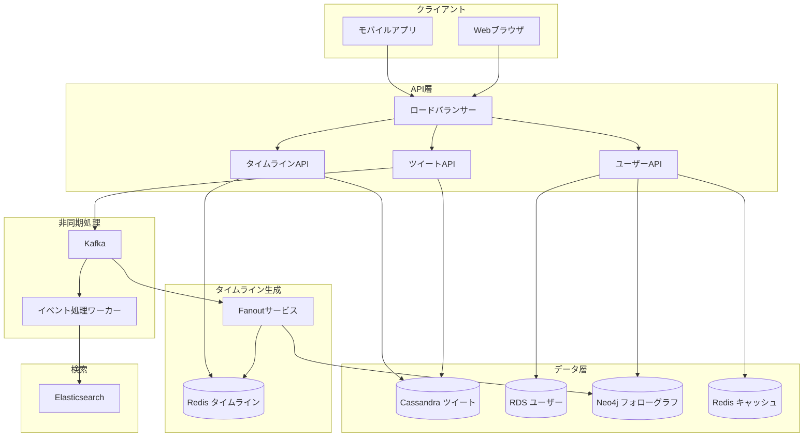
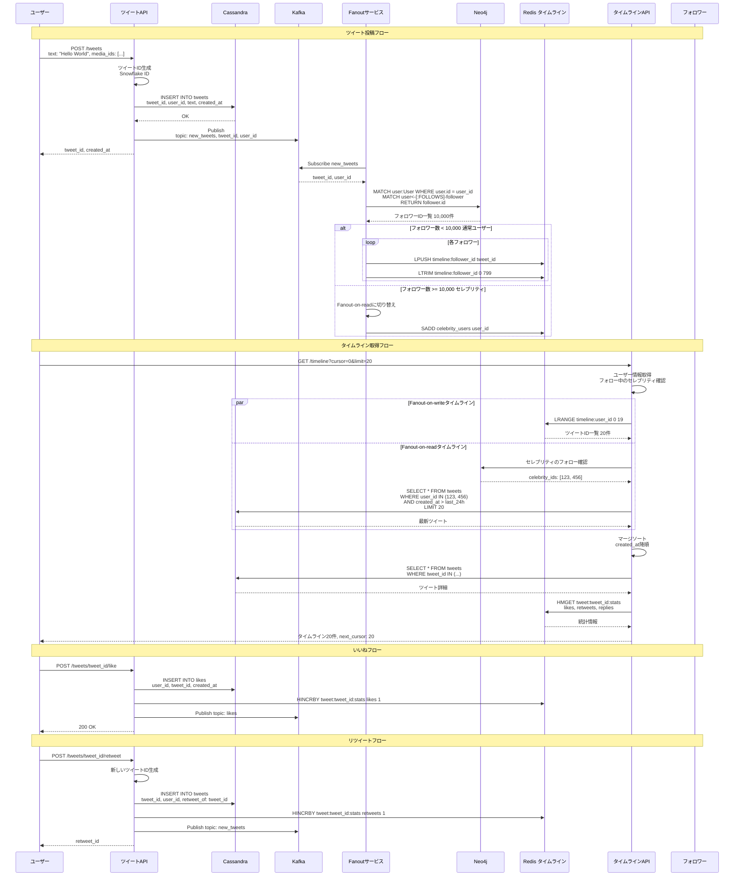
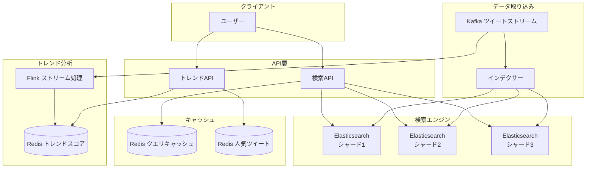
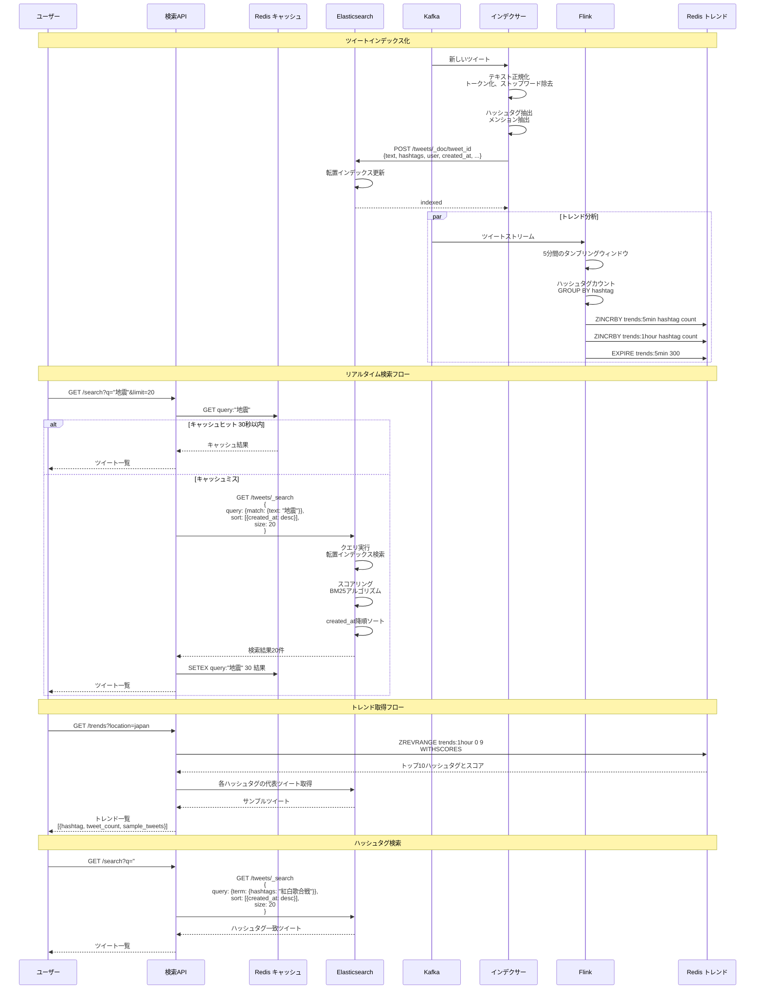
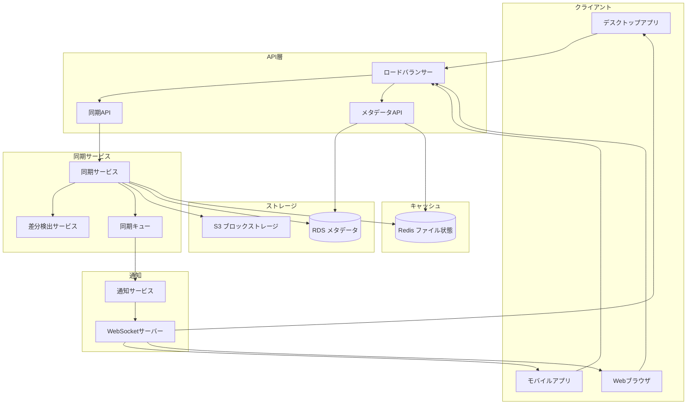
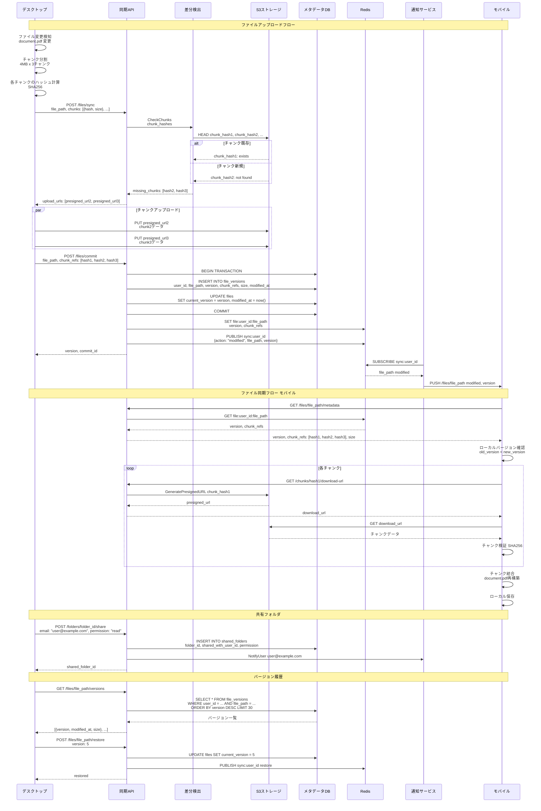

# 応用問題 Part 2

システム設計の応用問題として、SNS、ストレージサービスの設計を行います。

## SNSプラットフォームの設計

### 概要

数億ユーザーをサポートするSNSプラットフォームを設計します。
ツイート投稿、タイムライン生成、フォロー関係、リツイート、いいねを含みます。

### システム設計図

### 設計のポイント

Snowflake IDを使用してツイートIDを生成し、時系列ソートと分散システムでの一意性を両立します。
Fanout-on-writeとFanout-on-readのハイブリッドアプローチを使用します。通常ユーザーはFanout-on-writeで高速なタイムライン取得を実現し、フォロワー数が多いセレブリティはFanout-on-readでストレージコストを削減します。
Cassandraを使用してツイートを時系列で保存し、高速な書き込みと読み取りを実現します。
Neo4jを使用してフォローグラフを管理し、フォロワー取得を高速化します。
Redisでタイムラインをキャッシュし、各ユーザーの最新800ツイートを保持します。
Kafkaで非同期処理を行い、タイムライン生成、検索インデックス更新、通知配信を分離します。
いいね数、リツイート数はRedisで管理し、リアルタイムに更新します。

## SNSリアルタイム検索の設計

### 概要

ツイートをリアルタイムに検索できるシステムを設計します。
全文検索、トレンド検出、ハッシュタグ検索を含みます。

### システム設計図

### 設計のポイント

Elasticsearchを使用して全文検索を実装し、秒間数万件のツイートをリアルタイムにインデックス化します。
転置インデックスにより、キーワード検索を高速に実行します。
ハッシュタグは別フィールドとして保存し、完全一致検索を高速化します。
Flinkを使用してストリーム処理を行い、5分/1時間のウィンドウでハッシュタグをカウントしてトレンドを検出します。
Redisのソート済みセットでトレンドスコアを管理し、リアルタイムにランキングを更新します。
検索結果を30秒キャッシュし、同じクエリへの負荷を軽減します。
created_atフィールドで時系列ソートを行い、最新のツイートから表示します。
位置情報を使用して、地域別のトレンドを提供します。

## ファイル同期サービスの設計

### 概要

ファイル同期・共有サービスを設計します。
複数デバイス間のファイル同期、バージョン管理、共有機能を含みます。

### システム設計図

### 設計のポイント

ファイルをチャンク単位4MBに分割し、変更されたチャンクのみをアップロードすることで帯域幅を削減します。
チャンクのSHA256ハッシュを使用して重複排除を行い、ストレージコストを削減します。
S3でチャンクを保存し、メタデータDBでファイル構造とチャンクの参照を管理します。
Redisで最新のファイル状態をキャッシュし、メタデータ取得を高速化します。
WebSocketまたはロングポーリングで他デバイスに変更を通知し、リアルタイム同期を実現します。
バージョン履歴を保持し、過去30日間のファイルを復元できるようにします。
共有フォルダ機能で、複数ユーザーでのコラボレーションをサポートします。
Presigned URLを使用して、クライアントから直接S3にアップロード・ダウンロードし、APIサーバーの負荷を軽減します。
