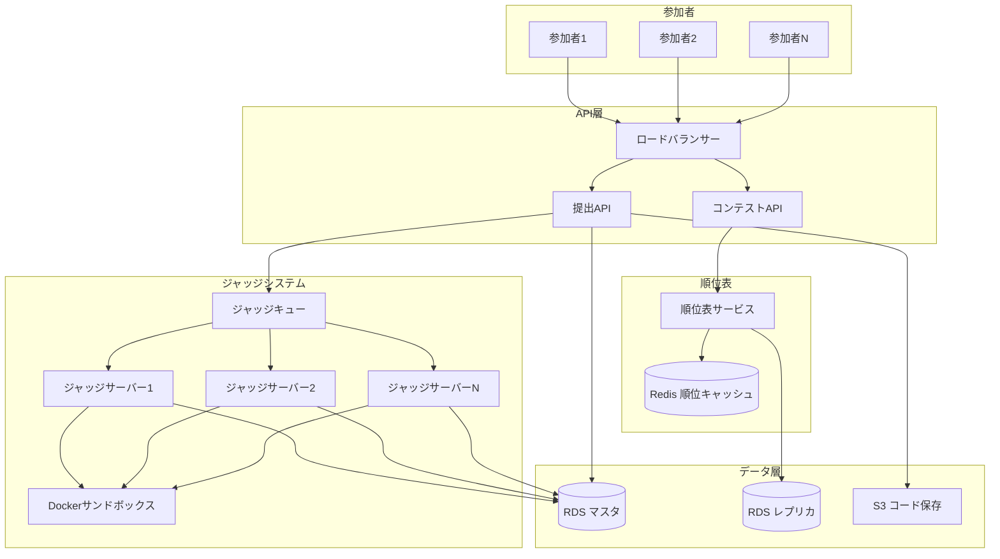
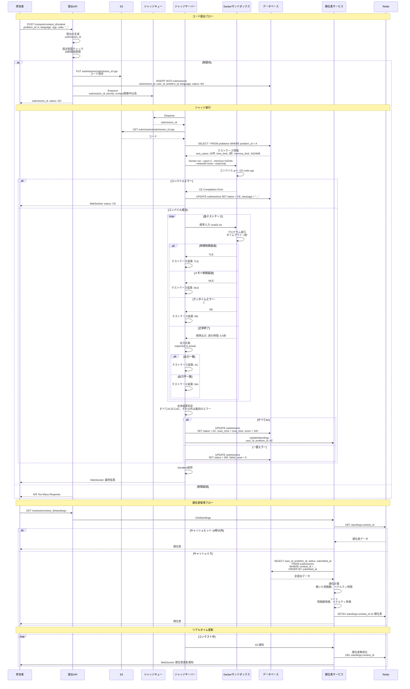
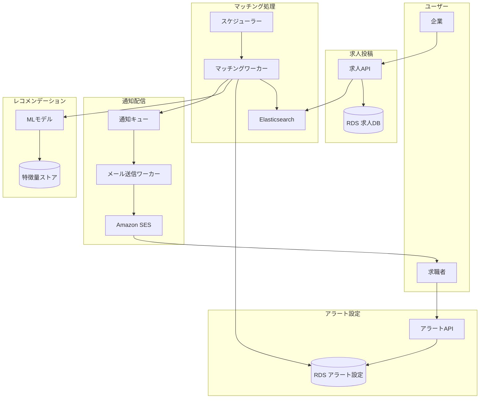
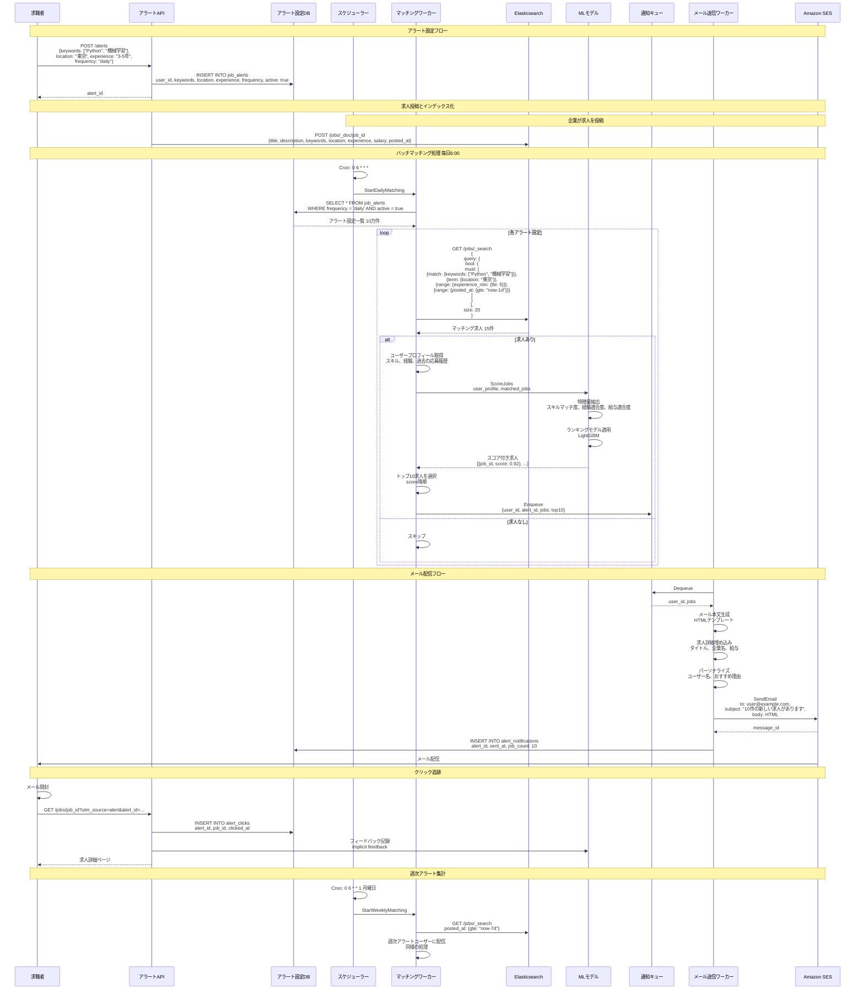
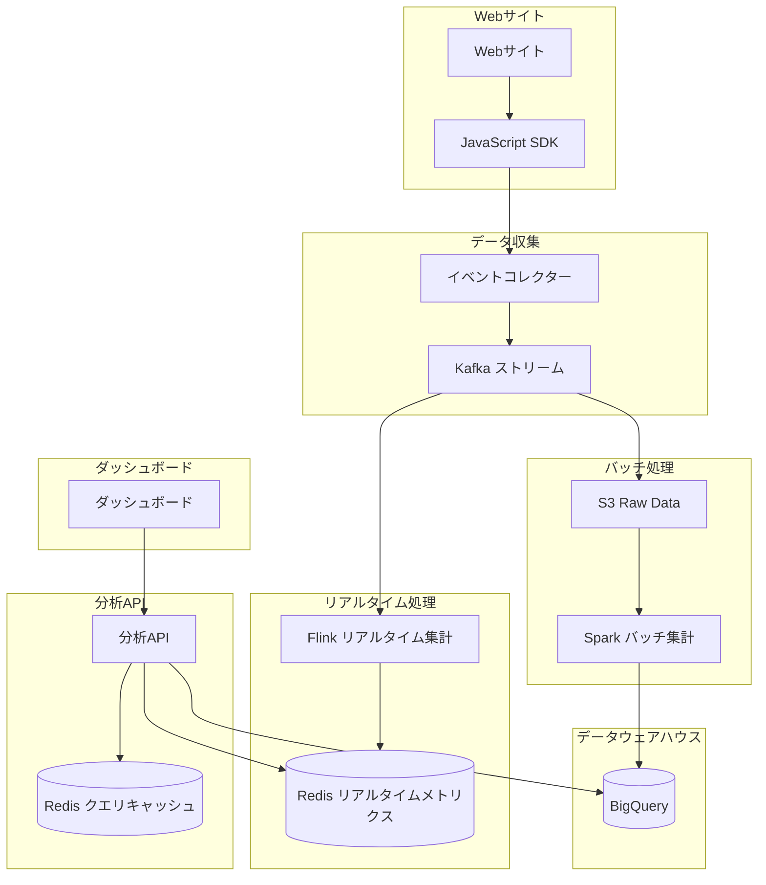
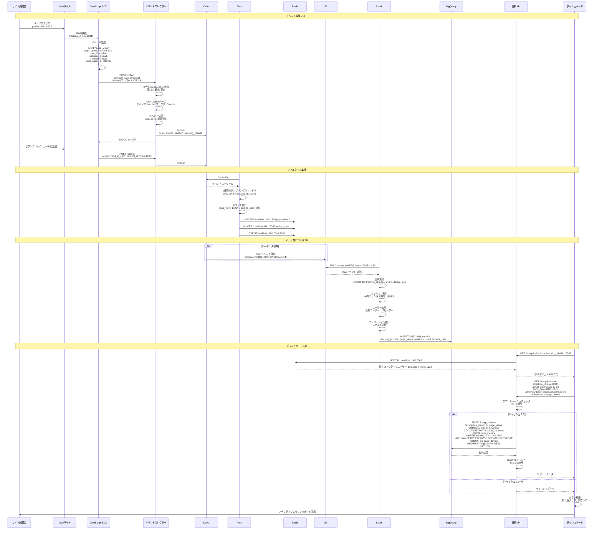

# 応用問題 Part 3

システム設計の応用問題として、競技プログラミング、求人サービス、分析サービスの設計を行います。

## 競技プログラミングコンテストの設計

### 概要

競技プログラミングコンテストのプラットフォームを設計します。
コード提出、ジャッジシステム、リアルタイム順位表、同時アクセス対策を含みます。

### システム設計図

### 設計のポイント

提出をキューに入れて非同期にジャッジすることで、同時大量提出に対応します。
Dockerコンテナでサンドボックス環境を構築し、セキュリティとリソース制限を実現します。
ネットワークを無効化し、読み取り専用ファイルシステムで悪意あるコードを防ぎます。
CPU、メモリ、実行時間の制限をDockerで設定します。
テストケースごとに実行し、最初のエラーで判定を終了することで効率化します。
順位表を10秒キャッシュし、頻繁なアクセスによるDB負荷を軽減します。
提出に30秒の間隔制限を設け、スパム提出を防ぎます。
WebSocketでリアルタイムにジャッジ結果と順位表更新を通知します。
コンテスト開催中の提出は優先度を上げてキューに入れます。

## ビジネスSNS求人アラートサービスの設計

### 概要

ユーザーの希望条件に合った求人を自動的に通知するシステムを設計します。
求人マッチング、バッチ処理、メール配信、レコメンデーションを含みます。

### システム設計図

### 設計のポイント

Elasticsearchで求人を全文検索し、キーワード、場所、経験年数で効率的にマッチングします。
バッチ処理で毎日決まった時間にマッチングを実行し、システム負荷を平準化します。
MLモデルでユーザープロフィールと求人の適合度をスコアリングし、パーソナライズされたレコメンデーションを提供します。
過去の応募履歴、クリック履歴を暗黙的フィードバックとしてモデルに学習させます。
メール配信を非同期キューで処理し、数十万通のメール送信を効率化します。
Amazon SESでメール配信し、開封率、クリック率を追跡します。
アラート頻度daily、weekly、monthlyを選択可能にし、ユーザーの好みに対応します。
求人が投稿されてから24時間以内のものだけを通知し、古い求人を除外します。

## Webアクセス解析サービスの設計

### 概要

Webサイトのアクセス解析プラットフォームを設計します。
イベント収集、リアルタイム分析、集計レポート、ダッシュボードを含みます。

### システム設計図

### 設計のポイント

1x1 GIF画像リクエストでイベントを収集し、ブラウザの制約を回避します。
Kafkaでイベントストリームを管理し、リアルタイム処理とバッチ処理の両方に対応します。
Flinkでリアルタイム集計を行い、現在のアクティブユーザー数を1分遅延で表示します。
Sparkで日次バッチ処理を行い、詳細な集計レポートをBigQueryに保存します。
BigQueryをデータウェアハウスとして使用し、大規模データの高速クエリを実現します。
レポートクエリを1時間キャッシュし、同じレポートへの重複クエリを削減します。
イベントをS3にRaw形式で保存し、後から再処理や監査が可能にします。
セッションIDでユーザー行動を追跡し、平均セッション時間、直帰率を計算します。
GeoLocationとUser-Agentから地域、デバイス、ブラウザを抽出し、ディメンションとして分析します。
